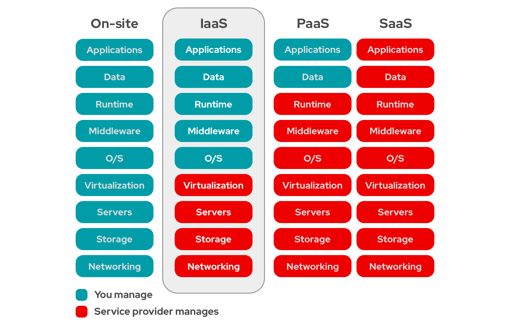

<!-- _class: portada -->
<!-- _paginate: false -->
<!-- _header: '' -->

# Introducción al **Cloud Computing**

## Infraestructura, modelos de servicio y OpenStack

  📧 José Domingo Muñoz
  🏫 IES Gonzalo Nazareno · Dos Hermanas
  📚 IV · Implantación de Aplicaciones Web

---

<!-- _class: capitulo -->
<!-- _paginate: false -->

01

# Evolución de la infraestructura

## Tradicional, virtualización e infraestructura en nube

---

## ¿A qué llamamos infraestructura?

> **Equipos para procesamiento, conexión y almacenamiento de datos.**

### Infraestructura tradicional

- Adquisición y montaje físico de equipos
- Conexión mediante redes físicas
- **Estática**: mismas configuraciones durante años
- Usuarios sin acceso directo

### Virtualización de máquinas

- Varios MVs en un solo equipo físico
- El software de gestión se llama **hipervisor**
- MVs conectadas en redes virtuales
- Ejemplos: KVM, Xen, Proxmox, VMware…

### Infraestructura en nube

- Virtualización de máquinas, **red** y **almacenamiento**
- Agrupamiento de recursos en clúster
- **Dinámica** y configuración automática
- El usuario **sí puede gestionar** su propia infraestructura

---

## Esquema de infraestructura IaaS

---

<!-- _class: capitulo -->
<!-- _paginate: false -->

02

# Cloud Computing

## Características, modelos de servicio y tipos de despliegue

---

## Características del Cloud Computing

### Modelo de consumo

- Servicio disponible **a demanda** y de forma automática
- Los servicios son **elásticos**: se crean o destruyen recursos según sea necesario
- Se **paga por uso**

### Modelo técnico

- Los servicios se comparten con otros usuarios garantizando **aislamiento y seguridad**
- Se ejecutan en un **clúster de ordenadores** ("la nube")
- Los servicios ofrecidos se denominan **… as a Service (…aaS)**

---

## Los tres niveles …aaS

> Modelo de negocio: **oferta de servicios** cloud, no venta de licencias o hardware.

### SaaS — *Software as a Service*

- Aplicación como servicio en la nube
- El usuario accede a través de la web
- Para **usuarios finales**
- Ejemplos: Google Workspace, Office 365

### PaaS — *Platform as a Service*

- Plataforma de desarrollo y despliegue en la nube
- Para **desarrolladores de software**
- Ejemplos: Heroku, OpenShift, CloudFoundry

### IaaS — *Infrastructure as a Service*

- Cómputo, redes y almacenamiento como servicio
- Para **administradores de sistemas**
- Ejemplos: AWS, Azure, GCE, OpenStack

---

## Comparativa On-site, IaaS, PaaS, SaaS

---

## Tipos de despliegue

### Público

Una empresa ofrece servicios a terceros, encargándose de **toda la gestión** del cloud.

**Ejemplos:** AWS, Azure, Google Cloud

### Privado

Una organización configura sus propios recursos de forma flexible. También llamado ***On-premise cloud***.

**Ejemplos:** OpenStack, VMware

### Híbrido

Se combinan recursos de nube **privada y pública** según las necesidades. Suelen compartir una API común para facilitar la integración.

---

## Cloud privado vs Cloud público

Los clouds públicos tienen aspectos negativos a tener en cuenta:

### Inconvenientes del cloud público

- **Privacidad** y **seguridad** de los datos
- **Vendor lock-in** — dependencia del proveedor
- Escaso **control sobre los datos**
- Limitada **personalización**
- Posibles problemas de **rendimiento**
- **Costes** difíciles de predecir

### ¿Cuándo considerar el cloud privado?

Un cloud **privado o híbrido** es una opción muy a tener en cuenta cuando alguno de los aspectos anteriores es importante para la organización.

**Opción principal:** OpenStack sobre hardware convencional.

---

## IaaS — caso de uso: demanda variable

**IaaS es especialmente adecuado para servicios con demanda variable, como el web.**

### Ejemplo: servicio de vídeo bajo demanda

- **Problema:** requisitos de hardware muy variables, con grandes picos y valles
- **Alto coste** en infraestructura tradicional
- **Solución con IaaS:**
  - Balanceadores para repartir la carga
  - Nuevos servidores creados automáticamente cuando se precisan
  - Servidores eliminados cuando baja la demanda

---

<!-- _class: capitulo -->
<!-- _paginate: false -->

03

# OpenStack

## Software libre para nubes públicas y privadas

---

## ¿Qué es OpenStack?

> **OpenStack** es software libre para crear y gestionar nubes públicas y privadas (IaaS).

---

## ¿Por qué OpenStack?

### Razones técnicas

- Permite montar un **IaaS propio** sobre hardware convencional
- Diseño **modular** con APIs web estándar
- Cada vez **más fácil de instalar**
- **Funcionalidades muy completas**

### Razones estratégicas

- **Software libre** (licencia Apache 2.0)
- Sin versión *enterprise* — sin vendor lock-in
- Proyecto **estable** con enorme respaldo industrial
- Proceso de diseño **abierto y transparente**
- Orientado a **estándares abiertos**

---

## Historia de OpenStack

- El proyecto nace hacia **2010** de dos iniciativas:
  - **Rackspace** — software de almacenamiento de objetos
  - **NASA** — software para IaaS
- En **septiembre de 2012** el control pasa a la **OpenStack Foundation**, hoy renombrada como **OpenInfra Foundation**
- Acoge a todos los desarrolladores y empresas que trabajan en OpenStack

### Versiones

- Hasta la versión **W**: nombres de ciudades donde se celebraba el *Summit* anual
- A partir de **Wallaby**: nombre propuesto por la comunidad
- A partir de **2023**: formato `año.N + palabra con A` — dos versiones por año

---

## Componentes principales de OpenStack

| Componente | Función |
|:--|:--|
| **Nova** | Gestión de las máquinas virtuales (Computación) |
| **Keystone** | Autenticación y autorización |
| **Glance** | Gestión de imágenes de MV |
| **Neutron** | Gestión de redes virtuales |
| **Cinder** | Almacenamiento en bloque (discos persistentes) |
| **Horizon** | Panel web de administración (*Dashboard*) |
| **Heat** | Orquestación de escenarios (infraestructura como código) |

ℹ️
OpenStack tiene muchos más componentes opcionales. Listado completo en <strong>openstack.org/software/project-navigator</strong>.

---

<!-- _class: cierre -->
<!-- _paginate: false -->

# ¡Gracias!

## Introducción al Cloud Computing

  📧 José Domingo Muñoz
  🏫 IES Gonzalo Nazareno · Dos Hermanas
  📚 IV

