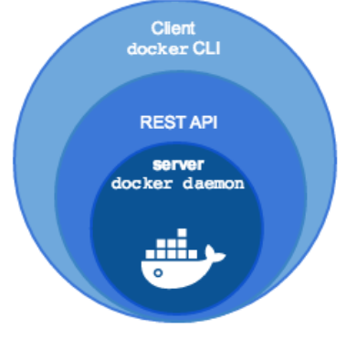

<!-- _class: portada -->
<!-- _paginate: false -->
<!-- _header: '' -->

# Virtualización en **contenedores**

## LXC, Docker y el ecosistema de contenedores

  📧 José Domingo Muñoz
  🏫 IES Gonzalo Nazareno · Dos Hermanas
  📚 IV · Implantación de Aplicaciones Web

---

<!-- _class: capitulo -->
<!-- _paginate: false -->

01

# Virtualización ligera en contenedores

## Concepto y tipos

---

## ¿Qué es la virtualización en contenedores?

- También llamada **virtualización a nivel de sistema operativo** o **virtualización basada en contenedores**
- Sobre el núcleo del SO se ejecuta una capa de virtualización que permite múltiples **instancias aisladas** de espacios de usuario
- Un **contenedor** es un conjunto de procesos aislados con:
  - **Sistema de ficheros** propio
  - **Configuración de red** propia
  - Acceso a los recursos del host (memoria y CPU)

---

## Tipos de contenedores

### Contenedores de sistema

Su uso es similar al de una **máquina virtual tradicional**:

- Se accede por **SSH**
- Se instalan servicios, se actualizan
- Ejecutan un conjunto de procesos en paralelo

**Ejemplo:** `LXC` *(Linux Container)*

### Contenedores de aplicación

Pensados para el **despliegue de aplicaciones** web:

- Una aplicación por contenedor
- Paradigma *build, ship and run*
- El contenedor se para cuando termina su proceso principal

**Ejemplos:** `Docker`, `Podman`

---

<!-- _class: capitulo -->
<!-- _paginate: false -->

02

# Introducción a LXC

## Linux Containers y LXD/Incus

---

## Linux Containers (LXC)

> **LXC** es una tecnología de **virtualización ligera** basada en dos componentes del kernel de Linux.

### Grupos de control (*cgroups*)

En Debian 11 se usa **cgroups v2**:

- Limita el uso de **recursos** de un proceso y sus hijos
- Controla: memoria, CPU, I/O, red

### Espacios de nombres (*namespaces*)

Proporcionan una **vista diferente** del sistema a cada proceso:

- Interfaces de red, procesos, usuarios, sistema de ficheros…

ℹ️
LXC pertenece a los <strong>contenedores de sistema</strong>. Mantenido por Canonical. Página oficial: <code>linuxcontainers.org</code>.

---

## LXD / Incus

### LXD — *Linux Container Daemon*

- Herramienta de gestión desarrollada por **Canonical**
- Ofrece una **REST API** accesible desde CLI o herramientas de terceros
- Gestiona **contenedores** (via LXC) y **máquinas virtuales** (via QEMU)

### Incus

- **Versión de la comunidad** de LXD
- Parte del proyecto Linux Containers
- Mismas capacidades: contenedores y MV bajo una única herramienta

---

<!-- _class: capitulo -->
<!-- _paginate: false -->

03

# Introducción a Docker

## Concepto, componentes y ecosistema

---

## ¿Qué es Docker?

> **Docker** es una tecnología de virtualización ligera cuyo objetivo es el **despliegue de aplicaciones** encapsuladas en contenedores bajo la filosofía **build, ship and run**.

### Características principales

- *"docker"* = **estibador** (quien carga y descarga contenedores)
- Pertenece a los **contenedores de aplicación**
- El contenedor **ejecuta un comando** y se detiene cuando este termina
- Cambia completamente la forma de **desplegar y distribuir** aplicaciones
- Escrito en **Go** — software libre (no todos los componentes)
- Desarrollado por **Docker, Inc.**

---

## Componentes del software Docker

### Docker Engine
- **Demonio Docker** — gestiona contenedores e imágenes
- **Docker API** — interfaz REST para automatización
- **Docker CLI** — cliente de línea de comandos

### Docker Registry
- Distribuye las **imágenes Docker**
- **Registro público**: Docker Hub (`hub.docker.com`)
- **Registro privado**: instalado en un servidor local

### Herramientas adicionales
- **docker-compose** — define aplicaciones multi-contenedor
- **docker swarm** — orquestador de contenedores

---

## Docker en la actualidad — CNCF

- En **2015** se crea la **Cloud Native Computing Foundation (CNCF)** como proyecto de la Linux Foundation para impulsar la tecnología de contenedores
- Todas las grandes empresas tecnológicas forman parte de la CNCF
- Docker Inc. se unió a la CNCF en **julio de 2016**
- Los componentes fundamentales de Docker son proyectos libres independientes:
  - **`runC`** — motor de ejecución de contenedores
  - **`containerd`** — gestión del ciclo de vida de contenedores
- Las **imágenes Docker** y su distribución se convierten en estándar abierto

---

## Distribuciones de Docker

| Variante | Descripción |
|:--|:--|
| **Moby** | Proyecto de comunidad. Paquete `docker.io` en Debian |
| **Docker CE** | *Community Edition* — proporcionado por Docker Inc. |
| **Docker EE** | *Enterprise Edition* — Docker engine + servicios de pago |

### Alternativas a Docker bajo estándares CNCF

- **`cri-o`** — creado por Red Hat, pensado para integrarse en Kubernetes
- **`podman`** — creado por Red Hat, alternativa sin demonio a Docker
- **`pouch`** — creado por Alibaba

---

## Contenedores y tipos de aplicación

### Aplicaciones monolíticas

Se usa un esquema **multicapa**:

- Cada servicio en un contenedor separado
- Servicio web + base de datos + caché…

### Aplicaciones con microservicios

El modelo que mejor se adapta a Docker:

- Cada **microservicio** en su propio contenedor
- Comunicación vía **HTTP REST** y colas de mensajes
- Facilita las **actualizaciones** de cada componente de forma independiente

---

<!-- _class: cierre -->
<!-- _paginate: false -->

# ¡Gracias!

## Virtualización en contenedores

  📧 José Domingo Muñoz
  🏫 IES Gonzalo Nazareno · Dos Hermanas
  📚 IV

