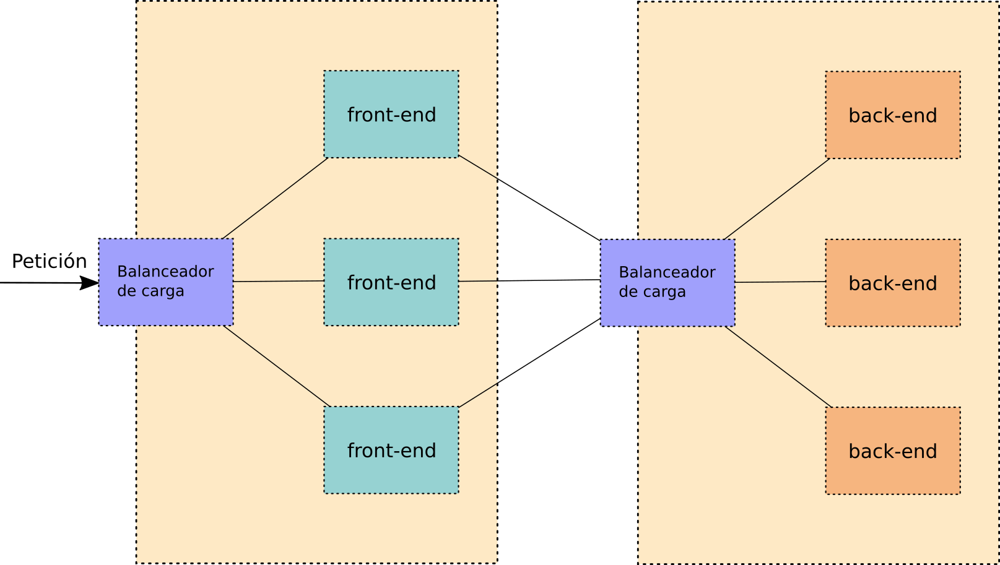
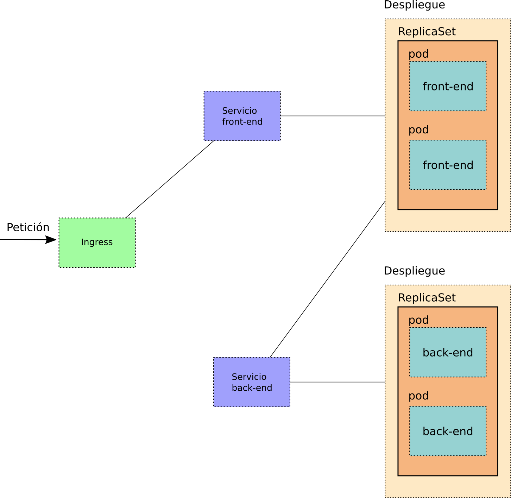

<!-- _class: portada -->
<!-- _paginate: false -->
<!-- _header: '' -->

# Introducción a **Kubernetes**

## Orquestación de contenedores en producción

  📧 José Domingo Muñoz
  🏫 IES Gonzalo Nazareno · Dos Hermanas
  📚 IV · Implantación de Aplicaciones Web

---

<!-- _class: capitulo -->
<!-- _paginate: false -->

01

# Orquestadores de contenedores

## Limitaciones de Docker y soluciones de orquestación

---

## Limitaciones de Docker Engine

Cuando desplegamos aplicaciones en producción con Docker Engine surgen preguntas sin respuesta:

### Disponibilidad y escalado

- ¿Cómo se **balancea la carga** entre múltiples contenedores iguales?
- ¿Se puede **variar a demanda** el número de réplicas de un contenedor?
- ¿Es posible **mover la carga** entre diferentes nodos?
- ¿Se puede actualizar una aplicación **sin interrupción**?

### Gestión y operación

- ¿Cómo se gestionan los **cambios entre versiones**?
- ¿Cómo se realizan los **cambios en producción**?
- ¿Cómo se conectan contenedores que se ejecutan en **diferentes demonios** de Docker?

---

## Orquestadores de contenedores

> Surge la necesidad de un software que gestione de forma coordinada **múltiples nodos** con contenedores y proporcione la funcionalidad necesaria para **poner aplicaciones en producción**.

### Principales orquestadores

- **Docker Swarm** — solución nativa de Docker
- **Apache Mesos** — gestión de recursos en clúster
- **HashiCorp Nomad** — orquestador multi-workload
- **Kubernetes** — estándar de facto actual

### ¿Qué aportan?

- Despliegue y actualización **automatizados**
- **Alta disponibilidad** y tolerancia a fallos
- **Escalado dinámico** de réplicas
- **Balanceo de carga** integrado
- Comunicación entre nodos del clúster

---

<!-- _class: capitulo -->
<!-- _paginate: false -->

02

# El proyecto Kubernetes

## Historia, características y ecosistema

---

## Origen del proyecto

- Google inicia el proyecto **Kubernetes en 2014** como software libre para orquestar contenedores
- No parte de cero: surge de una herramienta interna de Google llamada **Borg**, por lo que la primera versión ya era muy funcional
- Google cede el control del proyecto a la **Cloud Native Computing Foundation (CNCF)**

ℹ️
<strong>Kubernetes</strong> proviene del griego antiguo y significa <em>timonel</em>. Se abrevia habitualmente como <strong>k8s</strong> (8 letras entre la k y la s).

---

## ¿Qué es Kubernetes?

> **k8s** es un software pensado para gestionar completamente el **despliegue de aplicaciones sobre contenedores**.

### Capacidades principales

- Despliega aplicaciones **rápidamente**
- **Escala** las aplicaciones al vuelo
- Integra **cambios sin interrupciones**
- Permite **limitar los recursos** a utilizar

### Datos técnicos

- Desarrollado en **Go**
- Licencia **Apache 2.0** (software libre permisivo)
- Código en **GitHub** (`kubernetes/kubernetes`)
- Enorme **ecosistema** de herramientas complementarias: `landscape.cncf.io`

---

<!-- _class: capitulo -->
<!-- _paginate: false -->

03

# Arquitectura de Kubernetes

## Clúster, nodos master, workers y addons

---

## El clúster de Kubernetes

- k8s se instala en varios nodos que se gestionan de forma **coordinada** formando un **clúster**
- Los nodos pueden ser máquinas físicas, virtuales o habitualmente **instancias IaaS** (AWS, GCP, OpenStack…)

### Nodos master (*control plane*)

- Ejecutan los **servicios principales** de k8s
- **Ordenan** a los nodos worker qué contenedores ejecutar
- Son el cerebro del clúster

### Nodos worker

- **Reciben las órdenes** de los controladores
- En ellos se ejecutan los **contenedores de las aplicaciones**
- Son la fuerza de trabajo del clúster

---

## Componentes del nodo master

| Componente | Función |
|:--|:--|
| **kube-apiserver** | Gestiona la API de k8s — punto de entrada a todo el clúster |
| **etcd** | Almacén clave-valor con la **configuración del clúster** |
| **kube-scheduler** | Selecciona el nodo donde **ejecutar los contenedores** |
| **kube-controller-manager** | Ejecuta los **controladores** de k8s |
| **cloud-controller-manager** | Controladores que interactúan con el **proveedor de nube**: nodos, enrutamiento, balanceadores, volúmenes |
| **container runtime** | Ejecuta los contenedores necesarios (`containerd`, `docker`…) |

---

## Componentes de un nodo worker

| Componente | Función |
|:--|:--|
| **kubelet** | Controla los **Pods asignados** a su nodo |
| **kube-proxy** | Permite la **conexión a través de la red** |
| **container runtime** | Ejecuta los contenedores (`containerd`, `docker`…) |
| **supervisord** | Monitoriza y controla kubelet y el runtime |

---

## Complementos (*addons*)

Los componentes anteriores forman la estructura básica de k8s. Es habitual añadir funcionalidad adicional:

### Cluster DNS

Proporciona registros DNS para los servicios de k8s. Normalmente mediante **CoreDNS**.

### Web UI

Interfaz web para el manejo y monitorización del clúster.

### Container Resource Monitoring

Recoge métricas de forma centralizada: **Prometheus**, Sysdig…

### Cluster-level Logging

Almacena y gestiona los **logs de los contenedores** de forma centralizada.

---

## Alternativas para instalación de k8s

| Herramienta | Descripción | Uso recomendado |
|:--|:--|:--|
| **Minikube** | Clúster de un solo nodo en local. Proyecto oficial de k8s | **Aprendizaje** — la opción más sencilla |
| **kubeadm** | Clúster multi-nodo más realista. Instalación menos automatizada | **Laboratorio** con varios nodos |
| **kind** | Clúster multi-nodo sobre Docker. Proyecto oficial más reciente | **Desarrollo** y CI/CD |
| **k3s** | Versión ligera para producción. Pensada para IoT, edge, ARM | **Producción** en recursos limitados |

ℹ️
<strong>k3s</strong> lo desarrolló Rancher y hoy lo mantiene la CNCF. Es una opción real para entornos con recursos limitados o arquitecturas ARM.

---

<!-- _class: capitulo -->
<!-- _paginate: false -->

04

# Despliegues con Kubernetes

## Recursos: Pods, ReplicaSets, Deployments y Services

---

## Despliegue tradicional

---

## Despliegue con Kubernetes

---

## Recursos principales de k8s

### Pod

Unidad mínima de k8s. **Ejecuta uno o varios contenedores** que comparten red y almacenamiento.

### ReplicaSet

- Garantiza que no haya **caída del servicio**
- Gestiona la **tolerancia a fallos**
- Proporciona **escalabilidad dinámica**

### Deployment

- Gestiona las **actualizaciones continuas**
- Realiza **despliegues automáticos**
- Controla el historial de versiones y los *rollbacks*

### Service

- Gestiona el **acceso a los Pods**
- **Balancea la carga** entre los Pods disponibles
- Proporciona una IP y DNS estables, independientemente de los Pods

---

## Ingress

> Un **Ingress** gestiona el acceso desde el exterior al clúster a través de **nombre de dominio**, actuando como punto de entrada HTTP/HTTPS.

### Sin Ingress

- Cada Service de tipo `LoadBalancer` necesita una IP externa propia
- Costoso en entornos cloud (una IP pública por servicio)

### Con Ingress

- Una sola IP de entrada para **múltiples servicios**
- Enrutamiento por **nombre de dominio** o ruta URL
- Gestión centralizada de **TLS/HTTPS**

---

<!-- _class: cierre -->
<!-- _paginate: false -->

# ¡Gracias!

## Introducción a Kubernetes

  📧 José Domingo Muñoz
  🏫 IES Gonzalo Nazareno · Dos Hermanas
  📚 IV

