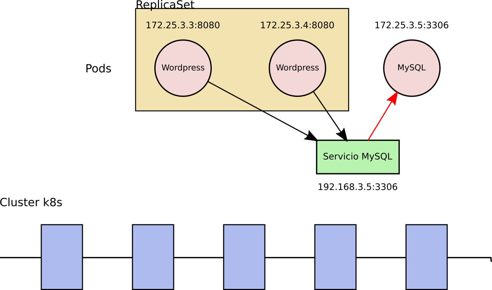
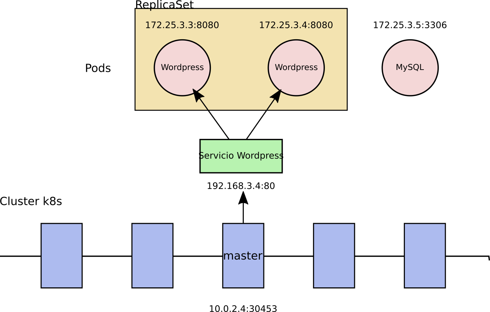
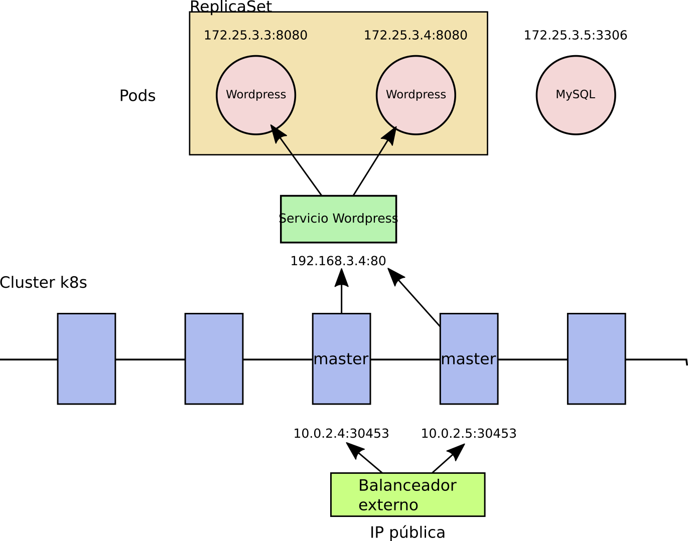
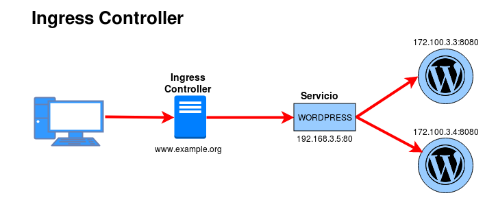
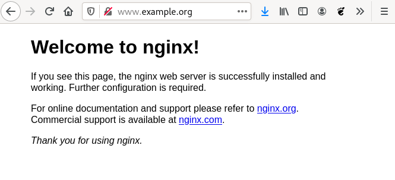

<!-- _class: portada -->
<!-- _paginate: false -->
<!-- _header: '' -->

# **Kubernetes**

## Recursos principales

<div style="margin-top:2rem; display:flex; flex-direction:column; gap:0.5rem; justify-content:center; font-size:0.85rem; color:white">
  <span>📧 José Domingo Muñoz</span>
  <span>🏫 IES Gonzalo Nazareno · Dos Hermanas</span>
  <span>📚 IV · Infraestructura Virtual</span>
</div>

---

<!-- _class: capitulo -->
<!-- _paginate: false -->

<p class="numero">01</p>

# Instalación de minikube y kubectl

## Entorno local de desarrollo con Kubernetes

---

## ¿Qué es Minikube?

**Minikube** permite desplegar localmente un **clúster de Kubernetes de un solo nodo**

<div class="cols-2" style="margin-top:0.8rem">

<div class="card card-blue">

### Características

- Proyecto **oficial de Kubernetes**
- Mantenimiento activo y compatibilidad con versiones actuales
- Una de las **mejores opciones para aprender k8s**
- Instalación sencilla en Linux, Windows y macOS

</div>

<div class="card card-green">

### Requisitos mínimos

- 2 CPUs
- 2 GiB de memoria RAM
- 20 GiB de espacio libre en disco
- Sistema de **virtualización o contenedores** (usaremos KVM)

</div>

</div>

---

## Arquitectura del clúster con Minikube

- Minikube crea una **máquina virtual Linux** con Kubernetes completamente configurado
- El clúster es de **un solo nodo** que asume doble rol:

<div class="cols-2" style="margin-top:0.8rem">

<div class="card card-blue">

### Master (control plane)

Ejecuta los **componentes principales** de Kubernetes: API server, scheduler, etcd…

</div>

<div class="card card-green">

### Worker

Ejecuta las **cargas de trabajo** en contenedores (Pods)

</div>

</div>

- Utilizaremos **Minikube sobre KVM**: virtualización nativa en Linux con mejor rendimiento

---

## Instalación de Minikube en Linux

Descargamos e instalamos el binario desde la web oficial:

**Paso 1** — Descargar el binario (arquitectura x86-64):

```bash
curl -LO https://storage.googleapis.com/minikube/releases/latest/minikube-linux-amd64
```

**Paso 2** — Mover a un directorio del PATH y dar permisos de ejecución:

```bash
sudo install minikube-linux-amd64 /usr/local/bin/minikube
```

**Verificar la instalación:**

```bash
minikube version
minikube version: v1.35.0
```

---

## Creación del clúster de Kubernetes

Lanzamos Minikube con el driver KVM para crear el clúster:

```bash
minikube start --driver=kvm2
```

Minikube crea automáticamente la VM, instala Kubernetes y configura `kubectl`.

**Comprobar el estado del clúster:**

```bash
minikube status
minikube
type: Control Plane
host: Running
kubelet: Running
apiserver: Running
kubeconfig: Configured
```

---

## Gestión del ciclo de vida de Minikube

Al trabajar en local podemos parar y arrancar el clúster cuando sea necesario:

**Parar:**

```bash
minikube stop
✋  Stopping node "minikube"  ...
🛑  1 nodes stopped.
```

**Arrancar de nuevo:**

```bash
minikube start
```

---

## ¿Qué es kubectl?

**kubectl** es la herramienta de línea de comandos para interactuar con la **API de Kubernetes**

- Herramienta fundamental para **gestionar todos los objetos** del clúster
- Se configura automáticamente al crear el clúster con Minikube
- Su configuración se almacena en `~/.kube/config`

**Instalación en Debian/Ubuntu:**

```bash
sudo apt install kubernetes-client
```

---

## Primeros comandos con kubectl

Comprobar los nodos del clúster:

```bash
kubectl get nodes
NAME       STATUS   ROLES                  AGE   VERSION
minikube   Ready    control-plane,master   21m   v1.32.0
```

Activar el **autocompletado** de kubectl:

```bash
echo 'source <(kubectl completion bash)' >> ~/.bashrc
source ~/.bashrc
```

---

<!-- _class: capitulo -->
<!-- _paginate: false -->

<p class="numero">02</p>

# Pods

## La unidad mínima de ejecución en Kubernetes

---

## ¿Qué es un Pod?

- Un **Pod** es la unidad mínima de ejecución en Kubernetes
- Actúa como una **envoltura** que contiene uno o varios contenedores
- Todos los contenedores de un Pod comparten **almacenamiento** y una **única IP**
- Los Pods son **efímeros**: se crean, se paran y se destruyen; pueden ser reemplazados por nuevos Pods

<div class="cols-2" style="margin-top:0.8rem">

<div class="card card-blue">

### Pod con un solo contenedor

Caso más habitual: un contenedor ejecutando un solo proceso (servidor web, servidor de aplicaciones, tarea programada…)

</div>

<div class="card card-green">

### Pod multicontenedor

Procesos fuertemente acoplados que necesitan compartir almacenamiento o IP (ej: nginx + php-fpm)

</div>

</div>

---

## ¿Por qué existe la capa Pod?

<div class="cols-2" style="margin-top:0.8rem">

<div class="card card-blue">

### Abstracción del runtime

K8s puede trabajar con distintos runtimes (`docker`, `containerd`, `cri-o`…). El Pod proporciona una interfaz **homogénea e independiente** del sistema de contenedores subyacente.

</div>

<div class="card card-green">

### Información adicional

El Pod añade metadatos necesarios para k8s:

- **Políticas de reinicio**
- **Readiness probe**: ¿está la app inicializada?
- **Liveness probe**: ¿sigue funcionando la app?

</div>

</div>

---

## Describiendo un Pod: fichero YAML

Forma **declarativa** (recomendada): definir el Pod en un fichero YAML

```yaml
apiVersion: v1        # Versión de la API
kind: Pod             # Tipo de recurso
metadata:
  name: pod-nginx     # Nombre del Pod
  labels:
    app: nginx        # Etiquetas clave/valor
    service: web
spec:
  containers:
    - image: nginx:1.16          # Imagen del contenedor
      name: contenedor-nginx     # Nombre del contenedor
      imagePullPolicy: Always    # Forzar descarga desde registro
```

---

## Campos principales del YAML

| Campo | Descripción |
|:--|:--|
| `apiVersion` | Versión de la API de k8s a utilizar |
| `kind` | Tipo de recurso (`Pod`, `Deployment`…) |
| `metadata.name` | Nombre único del Pod en el clúster |
| `metadata.labels` | Etiquetas clave/valor para identificar y seleccionar recursos |
| `spec.containers[].image` | Imagen Docker del contenedor |
| `spec.containers[].imagePullPolicy` | `IfNotPresent` (defecto) o `Always` (fuerza descarga) |

---

## Vídeo: Describiendo un Pod

[https://www.youtube.com/watch?v=zMkXnENOBBc](https://www.youtube.com/watch?v=zMkXnENOBBc)

---

## Creando y consultando Pods

**Forma imperativa** (rápida, sin fichero):

```bash
kubectl run pod-nginx --image=nginx
```

**Forma declarativa** (recomendada):

```bash
kubectl create -f pod.yaml
```

**Consultar estado de los Pods:**

```bash
kubectl get pods                # Estado básico
kubectl get pod -o wide         # Con nodo asignado e IP
kubectl describe pod pod-nginx  # Información detallada
```

---

## Operando con Pods

**Ver logs** del contenedor:

```bash
kubectl logs pod-nginx
```

**Ejecutar comando** (o abrir shell) en el Pod:

```bash
kubectl exec -it pod-nginx -- /bin/bash
```

**Redirigir un puerto** para pruebas locales:

```bash
kubectl port-forward pod-nginx 8080:80
# Acceso en http://localhost:8080
```

> `port-forward` es solo para pruebas. El acceso real a servicios se gestiona con el recurso **Service**.

---

## Etiquetas (Labels)

Las etiquetas permiten **identificar y filtrar** recursos en clústeres con cientos de objetos:

```bash
kubectl get pods --show-labels          # Ver etiquetas
kubectl label pods pod-nginx service=web --overwrite=true  # Añadir/modificar

kubectl get pods -l service=web         # Filtrar por etiqueta
kubectl get pods -Lservice              # Mostrar etiqueta como columna
```

**Eliminar un Pod:**

```bash
kubectl delete pod pod-nginx
```

---

## Vídeo: Gestionando Pods

[https://www.youtube.com/watch?v=OA0OheCtrXo](https://www.youtube.com/watch?v=OA0OheCtrXo)

---

<!-- _class: capitulo -->
<!-- _paginate: false -->

<p class="numero">03</p>

# ReplicaSet

## Tolerancia a fallos y escalabilidad dinámica

---

## ¿Qué es un ReplicaSet?

- Recurso de k8s que garantiza que siempre se ejecuta un **número concreto de réplicas** de un Pod
- En la práctica **no trabajaremos directamente con Pods**, sino a través de ReplicaSets

<div class="cols-2" style="margin-top:0.8rem">

<div class="card card-blue">

### Tolerancia a fallos

Si un Pod falla o el nodo donde corre se apaga, el ReplicaSet **crea automáticamente** nuevos Pods en otro nodo para mantener el número deseado

</div>

<div class="card card-green">

### Escalabilidad dinámica

Permite **aumentar o reducir** el número de réplicas del Pod en cualquier momento según las necesidades

</div>

</div>

---

## Describiendo un ReplicaSet: YAML

```yaml
apiVersion: apps/v1
kind: ReplicaSet
metadata:
  name: replicaset-nginx
spec:
  replicas: 2          # Número de Pods siempre en ejecución
  selector:
    matchLabels:
      app: nginx       # Controla los Pods con esta etiqueta
  template:            # Definición del Pod que se replicará
    metadata:
      labels:
        app: nginx     # Debe coincidir con el selector
    spec:
      containers:
        - image: nginx
          name: contenedor-nginx
```

---

## Campos clave del ReplicaSet

| Campo | Descripción |
|:--|:--|
| `replicas` | Número de Pods que deben estar siempre en ejecución |
| `selector.matchLabels` | Etiquetas que identifican los Pods que controla el RS |
| `template` | Definición del Pod que creará el ReplicaSet |
| `template.metadata.labels` | Debe coincidir con `selector.matchLabels` |

---

## Vídeo: Describiendo un ReplicaSet

[https://www.youtube.com/watch?v=VL3J63JqV5o](https://www.youtube.com/watch?v=VL3J63JqV5o)

---

## `kubectl create` vs `kubectl apply`

<div class="cols-2" style="margin-top:0.8rem">

<div class="card card-yellow">

### Imperativa (`create`)

Define la acción a realizar. Si el objeto cambia, hay que borrarlo y recrearlo.

```bash
kubectl create -f recurso.yaml
kubectl delete -f recurso.yaml
```

</div>

<div class="card card-blue">

### Declarativa (`apply`) ✓ Recomendada

Define el **estado deseado**. Permite modificar el objeto aplicando los cambios.

```bash
kubectl apply -f recurso.yaml
```

</div>

</div>

---

## Creando y consultando el ReplicaSet

```bash
kubectl apply -f nginx-rs.yaml    # Crear el ReplicaSet

kubectl get rs,pods               # Ver RS y Pods creados
kubectl describe rs replicaset-nginx  # Información detallada
```

---

## Tolerancia a fallos

Si borramos un Pod, el ReplicaSet crea uno nuevo de forma **inmediata y automática**:

```bash
kubectl delete pod <nombre_del_pod>
kubectl get pods   # Aparece un nuevo Pod reemplazando al borrado
```

---

## Escalabilidad

Escalar el número de réplicas desde la línea de comandos:

```bash
kubectl scale rs replicaset-nginx --replicas=5
kubectl get pods
```

O modificando el campo `replicas` en el fichero YAML y reaplicando:

```bash
kubectl apply -f nginx-rs.yaml
```

Reducir réplicas:

```bash
kubectl scale rs replicaset-nginx --replicas=1
```

---

## Eliminando el ReplicaSet

Al borrar un ReplicaSet se eliminan **todos los Pods** asociados:

```bash
kubectl delete rs replicaset-nginx
# o bien:
kubectl delete -f nginx-rs.yaml
```

---

## Vídeo: Gestionando ReplicaSets

[https://www.youtube.com/watch?v=MeCraOsxRPo](https://www.youtube.com/watch?v=MeCraOsxRPo)

---

<!-- _class: capitulo -->
<!-- _paginate: false -->

<p class="numero">04</p>

# Deployment

## La unidad de despliegue de más alto nivel en Kubernetes

---

## ¿Qué es un Deployment?

- Es la **unidad de más alto nivel** para gestionar aplicaciones en k8s
- Al crear un Deployment se crea automáticamente un **ReplicaSet** que controla los Pods
- Guarda un **historial de ReplicaSets** según las versiones de imagen desplegadas

<div class="cols-2" style="margin-top:0.8rem">

<div class="card card-blue">

### Funcionalidades

- Control de réplicas
- Escalabilidad de Pods
- Actualizaciones continuas (*rolling update*)
- **Rollback** a versiones anteriores

</div>

<div class="card card-green">

### Tipos de aplicaciones

- **Multi-servicio**: varios Deployments (ej: app PHP + base de datos)
- **Microservicios**: un Deployment por microservicio (ej: frontend + backend API)

</div>

</div>

---

## Describiendo un Deployment: YAML

```yaml
apiVersion: apps/v1
kind: Deployment
metadata:
  name: deployment-nginx
  labels:
    app: nginx
spec:
  revisionHistoryLimit: 2   # ReplicaSets antiguos a conservar (defecto: 10)
  strategy:
    type: RollingUpdate     # Recreate | RollingUpdate (defecto)
  replicas: 2
  selector:
    matchLabels:
      app: nginx
  template:
    metadata:
      labels:
        app: nginx
    spec:
      containers:
      - image: nginx
        name: contenedor-nginx
        ports:
        - name: http
          containerPort: 80
```

---

## Estrategias de actualización

| Estrategia | Comportamiento |
|:--|:--|
| `RollingUpdate` | Crea nuevos Pods, comprueba que funcionan y elimina los antiguos. **Sin corte de servicio**. Es la opción por defecto. |
| `Recreate` | Elimina todos los Pods antiguos y después crea los nuevos. Provoca **interrupción del servicio**. |

---

## Vídeo: Describiendo un Deployment

[https://www.youtube.com/watch?v=NBsc_fILt8g](https://www.youtube.com/watch?v=NBsc_fILt8g)

---

## Gestionando Deployments

```bash
kubectl apply -f nginx-deployment.yaml   # Crear el Deployment
kubectl get deploy,rs,pod                # Ver todos los recursos
kubectl get all                          # Deployments, RS, Pods y Services
```

**Escalar réplicas:**

```bash
kubectl scale deployment deployment-nginx --replicas=4
```

**Acceso, logs e información:**

```bash
kubectl port-forward deployment/deployment-nginx 8080:80
kubectl logs deployment/deployment-nginx
kubectl describe deployment/deployment-nginx
```

**Eliminar** (borra también el ReplicaSet y los Pods):

```bash
kubectl delete deployment deployment-nginx
```

---

## Vídeo: Gestionando Deployments

[https://www.youtube.com/watch?v=dcKWO6gXhhs](https://www.youtube.com/watch?v=dcKWO6gXhhs)

---

## Actualización de un Deployment (*rollout*)

Al cambiar la imagen, k8s crea un **nuevo ReplicaSet** y aplica la estrategia de despliegue:

```bash
# Modificar la imagen directamente:
kubectl set image deployment/mediawiki contenedor-mediawiki=mediawiki:1.39.1

# Anotar el motivo del cambio:
kubectl annotate deployment/mediawiki kubernetes.io/change-cause="Actualización a 1.39.1"

# Ver historial de revisiones:
kubectl rollout history deployment/mediawiki
```

```
REVISION  CHANGE-CAUSE
1         Primer despliegue. Desplegamos versión 1.38.5
2         Segundo despliegue. Actualizamos a la versión 1.39.1
```

---

## Rollback del Deployment

Si el nuevo despliegue falla, volver a la versión anterior es inmediato:

```bash
kubectl rollout undo deployment/mediawiki
```

k8s activa el ReplicaSet anterior. El historial se actualiza:

```
REVISION  CHANGE-CAUSE
1         Primer despliegue. Desplegamos versión 1.38.5
3         Tercer despliegue. Actualizamos a la versión 2 (fallido)
4         Segundo despliegue. Actualizamos a la versión 1.39.1
```

---

## Vídeo: Rollout y Rollback

[https://www.youtube.com/watch?v=6LjTwopWDFw](https://www.youtube.com/watch?v=6LjTwopWDFw)

---

<!-- _class: capitulo -->
<!-- _paginate: false -->

<p class="numero">05</p>

# Services e Ingress

## Acceso a las aplicaciones desplegadas en Kubernetes

---

## ¿Qué es un Service?

- Abstracción que permite **acceder a un conjunto de Pods** de un Deployment
- Proporciona una **IP virtual (ClusterIP) y un nombre DNS** estable, independiente de la vida de los Pods
- **Balancea la carga** entre los Pods asociados con política Round Robin
- El componente **CoreDNS** resuelve el nombre del Service a su ClusterIP

---

## Tipos de Services

| Tipo | Acceso | Uso |
|:--|:--|:--|
| **ClusterIP** | Solo interno al clúster | Bases de datos, servicios internos |
| **NodePort** | Exterior vía puerto aleatorio 30000-40000 | Pruebas y desarrollo |
| **LoadBalancer** | Exterior vía cloud público | GKE, AWS, AKS… |
| **Ingress** | Exterior vía proxy inverso por nombre de host | Producción |

---

## ClusterIP

Acceso **solo interno** al clúster. Es el tipo por defecto.



---

## NodePort

Abre un **puerto aleatorio (30000-40000)** en el nodo para acceso desde el exterior.



---

## LoadBalancer

Solo disponible en **cloud público** (GKE, AWS, AKS…). El proveedor asigna un balanceador de carga con IP pública.



---

## Describiendo un Service NodePort: YAML

```yaml
apiVersion: v1
kind: Service
metadata:
  name: nginx          # Nombre usado también para DNS
spec:
  type: NodePort
  ports:
  - name: service-http
    port: 80           # Puerto del Service
    targetPort: http   # Puerto del contenedor (por nombre o número)
  selector:
    app: nginx         # Selecciona los Pods por etiqueta
```

> Un Service **ClusterIP** es idéntico pero con `type: ClusterIP`.

---

## Vídeo: Describiendo Services

[https://www.youtube.com/watch?v=kI2rZmqA7TI](https://www.youtube.com/watch?v=kI2rZmqA7TI)

---

## Gestionando Services

```bash
kubectl apply -f nginx-srv.yaml        # Crear el Service
kubectl get services                   # Listar Services
kubectl describe service/nginx         # Información detallada
```

**Acceder a la aplicación (NodePort):**

```bash
minikube ip                            # Obtener IP del nodo master
# → 192.168.39.222
# Acceder desde el navegador: 192.168.39.222:<puerto_asignado>
```

**Eliminar un Service:**

```bash
kubectl delete service nginx
```

---

## Vídeo: Gestionando Services

[https://www.youtube.com/watch?v=UAaBzXG13XU](https://www.youtube.com/watch?v=UAaBzXG13XU)

---

## DNS en Kubernetes

El componente **CoreDNS** crea un registro DNS por cada Service:

```
<nombre_servicio>.<namespace>.svc.cluster.local
```

Los Pods pueden resolver el nombre corto del Service gracias al campo `search` de `/etc/resolv.conf`:

```bash
kubectl exec -it busybox -- nslookup nginx
# → nginx.default.svc.cluster.local → 10.110.81.74

kubectl exec -it busybox -- wget http://nginx   # Acceso por nombre
```

> Al configurar una aplicación (ej: Wordpress), se usa el **nombre del Service** de la base de datos como host de conexión, no su IP.

---

## Vídeo: DNS en Kubernetes

[https://www.youtube.com/watch?v=nxnyRvdHpsI](https://www.youtube.com/watch?v=nxnyRvdHpsI)

---

## Ingress Controller

**Problema**: NodePort usa puertos aleatorios (30000-40000); LoadBalancer requiere cloud público.

**Solución**: Ingress Controller — un **proxy inverso** (nginx, traefik…) que enruta tráfico HTTP por nombre de host.



**Activar Ingress en Minikube:**

```bash
minikube addons enable ingress
kubectl get pods -n ingress-nginx      # Verificar que está corriendo
```

---

## Describiendo un recurso Ingress

```yaml
apiVersion: networking.k8s.io/v1
kind: Ingress
metadata:
  name: nginx
spec:
  rules:
  - host: www.example.org        # Nombre de host de acceso
    http:
      paths:
      - path: /
        pathType: Prefix
        backend:
          service:
            name: nginx          # Service de destino
            port:
              number: 80
```

> Con Ingress **no es necesario** que el Service sea NodePort para acceder desde el exterior.

---

## Gestionando Ingress

```bash
kubectl apply -f ingress.yaml
kubectl get ingress
kubectl describe ingress/nginx
```

Para pruebas sin DNS, añadir al `/etc/hosts` del anfitrión:

```
192.168.39.222  www.example.org
```



---

## Vídeo: Ingress Controller

[https://www.youtube.com/watch?v=X2dW9UbfU88](https://www.youtube.com/watch?v=X2dW9UbfU88)

---

<!-- _class: capitulo -->
<!-- _paginate: false -->

<p class="numero">06</p>

# Variables de entorno, ConfigMaps y Secrets

## Configuración parametrizada de aplicaciones

---

## Variables de entorno

Los contenedores se pueden configurar mediante **variables de entorno** definidas en el YAML del Deployment:

```yaml
spec:
  containers:
    - name: contenedor-mariadb
      image: mariadb
      ports:
        - containerPort: 3306
          name: db-port
      env:
        - name: MARIADB_ROOT_PASSWORD
          value: my-password
```

**Inconveniente**: los valores quedan escritos en texto plano dentro del fichero YAML, que habitualmente se guarda en un repositorio git.

---

## Vídeo: Variables de entorno

[https://www.youtube.com/watch?v=MazyA8LP8Oc](https://www.youtube.com/watch?v=MazyA8LP8Oc)

---

## ConfigMaps

Recurso k8s para almacenar pares **clave-valor** de configuración, desacoplados del Deployment:

```bash
kubectl create cm mariadb \
  --from-literal=root_password=my-password \
  --from-literal=mysql_usuario=usuario \
  --from-literal=mysql_password=password-user \
  --from-literal=basededatos=test

kubectl get cm
kubectl describe cm mariadb
```

**Referenciar en el Deployment:**

```yaml
env:
  - name: MARIADB_ROOT_PASSWORD
    valueFrom:
      configMapKeyRef:
        name: mariadb
        key: root_password
```

---

## Vídeo: ConfigMaps

[https://www.youtube.com/watch?v=QVC9TsHpXvc](https://www.youtube.com/watch?v=QVC9TsHpXvc)

---

## Secrets

Para información **sensible** (contraseñas, claves SSH…). Los valores se almacenan **codificados en base64**:

```bash
kubectl create secret generic mariadb --from-literal=password=my-password
kubectl get secret
kubectl describe secret mariadb
```

**Referenciar en el Deployment:**

```yaml
env:
  - name: MARIADB_ROOT_PASSWORD
    valueFrom:
      secretKeyRef:
        name: mariadb
        key: password
```

> Por defecto k8s **no cifra** los Secrets, solo los codifica en base64. El cifrado en reposo requiere configuración adicional.

---

## Vídeo: Secrets

[https://www.youtube.com/watch?v=lckojEFiUiw](https://www.youtube.com/watch?v=lckojEFiUiw)

---

<!-- _class: capitulo -->
<!-- _paginate: false -->

<p class="numero">07</p>

# Volúmenes

## Almacenamiento persistente en Kubernetes

---

## ¿Por qué son necesarios los volúmenes?

Los **Pods son efímeros**: al eliminarse se pierde toda su información.

<div class="cols-2" style="margin-top:0.8rem">

<div class="card card-blue">

### Problemas sin volúmenes

- Eliminar el Pod de la BD → **se pierden todos los datos**
- Escalar la BD → Pods **sin datos sincronizados**
- Subir una imagen al servidor web → **se pierde** si el Pod se reinicia
- Escalar el servidor web → **cada Pod tiene su propia copia**

</div>

<div class="card card-green">

### Con volúmenes conseguimos

- Información **persistente** aunque el Pod se elimine
- Varios Pods leen y escriben **la misma información**
- Contenedores dentro del mismo Pod pueden **compartir datos**

</div>

</div>

---

## Tipos de volúmenes

| Tipo | Descripción |
|:--|:--|
| `hostPath` | Monta un directorio del nodo en el Pod. Usado con Minikube. |
| `emptyDir` | Efímero con la vida del Pod. Para compartir entre contenedores. |
| `configMap` | Expone un ConfigMap como directorio dentro del Pod. |
| `nfs`, `cephfs`, `glusterfs` | Almacenamiento en red para clusters multi-nodo. |
| Cloud (AWS EBS, Azure Disk…) | Provistos por el proveedor de infraestructura. |

---

## Vídeo: Volúmenes en Kubernetes

[https://www.youtube.com/watch?v=g1Elyt_OuqA](https://www.youtube.com/watch?v=g1Elyt_OuqA)

---

## Aprovisionamiento de volúmenes

Hay dos formas de aprovisionar almacenamiento en Kubernetes:

<div class="cols-2" style="margin-top:0.8rem">

<div class="card card-yellow">

### Estático

El administrador crea **manualmente** objetos `PersistentVolume` (PV). No usaremos esta modalidad en el curso.

</div>

<div class="card card-blue">

### Dinámico ✓ (lo que usaremos)

Un **aprovisionador** crea el PV automáticamente cuando el desarrollador lo solicita.

Se define en un objeto **StorageClass**.

En Minikube ya existe uno por defecto:

```bash
kubectl get storageclass
NAME                 PROVISIONER
standard (default)   k8s.io/minikube-hostpath
```

</div>

</div>

---

## Vídeo: Aprovisionamiento de volúmenes

[https://www.youtube.com/watch?v=7D9R0_f60-Q](https://www.youtube.com/watch?v=7D9R0_f60-Q)

---

## Solicitud de volúmenes: PersistentVolumeClaim

El **desarrollador** solicita almacenamiento sin conocer los detalles del backend:

```yaml
apiVersion: v1
kind: PersistentVolumeClaim
metadata:
  name: pvc-ejemplo2
spec:
  accessModes:
    - ReadWriteOnce
  resources:
    requests:
      storage: 1Gi
```

> Al no indicar `storageClassName`, se usa el StorageClass por defecto. El aprovisionador crea el PV automáticamente y lo asocia al PVC (`Bound`).

```bash
kubectl apply -f pvc-ejemplo2.yaml
kubectl get pv,pvc    # PV creado dinámicamente en estado Bound
```

---

## Vídeo: Solicitud de volúmenes

[https://www.youtube.com/watch?v=YV21W_hjo0Q](https://www.youtube.com/watch?v=YV21W_hjo0Q)

---

## Uso del volumen en un Deployment

```yaml
spec:
  volumes:
    - name: volumen-datos
      persistentVolumeClaim:
        claimName: pvc-ejemplo2    # Referencia al PVC
  containers:
    - name: contenedor-nginx
      image: nginx
      volumeMounts:
        - mountPath: "/usr/share/nginx/html"   # Punto de montaje
          name: volumen-datos
```

> Cuando el Pod termina, el PVC mantiene el volumen **reservado (Bound)**. Hay que borrar el PVC explícitamente para liberarlo.

> Con aprovisionamiento dinámico y política `Delete`, al borrar el PVC **también se borra el PV**.

---

## Vídeo: Ejemplo con aprovisionamiento dinámico

[https://www.youtube.com/watch?v=hxeizzHQsHw](https://www.youtube.com/watch?v=hxeizzHQsHw)

---

## Ejemplo: Wordpress con almacenamiento persistente

Despliegue completo con **dos volúmenes** aprovisionados dinámicamente:

```bash
# Solicitar volúmenes
kubectl apply -f wordpress-pvc.yaml    # 5 Gi para Wordpress (/var/www/html)
kubectl apply -f mariadb-pvc.yaml     # 5 Gi para MariaDB (/var/lib/mysql)

kubectl get pv,pvc    # Dos PVs creados dinámicamente
```

Los Deployments referencian cada PVC en su sección `volumes` y `volumeMounts`.

```bash
# Desplegar la aplicación completa
kubectl apply -f mariadb-deployment.yaml
kubectl apply -f wordpress-deployment.yaml
kubectl apply -f mariadb-srv.yaml
kubectl apply -f wordpress-srv.yaml
kubectl apply -f wordpress-ingress.yaml
```

---

## Comprobando la persistencia

Eliminar y recrear los Deployments no borra los datos:

```bash
kubectl delete -f mariadb-deployment.yaml
kubectl delete -f wordpress-deployment.yaml

kubectl apply -f mariadb-deployment.yaml
kubectl apply -f wordpress-deployment.yaml
# La aplicación funciona con toda la información intacta
```

> La información vive en los **volúmenes**, no en los Pods. Mientras existan los PVCs, los datos están a salvo.

---

## Vídeo: Wordpress con almacenamiento persistente

[https://www.youtube.com/watch?v=fLMALdJ905E](https://www.youtube.com/watch?v=fLMALdJ905E)

---

<!-- _class: capitulo -->
<!-- _paginate: false -->

<p class="numero">08</p>

# Otros recursos de Kubernetes

## StatefulSet, DaemonSet, Job y CronJob

---

## ¿Deployment para todo?

Los **Deployments** son la carga de trabajo principal en Kubernetes, pero no se ajustan a todos los casos.

<div class="cols-2" style="margin-top:0.8rem">

<div class="card card-green">

### Aplicaciones *stateless* (sin estado)

Cada petición es **totalmente independiente** de las anteriores. Son perfectas para Deployments: se escalan y balancean sin problemas.

Ejemplo: servidor web, servicio DNS, API REST

</div>

<div class="card card-blue">

### Aplicaciones *stateful* (con estado)

Una petición **puede verse afectada** por el resultado de las anteriores. Un Deployment no gestiona bien su estado.

Ejemplo: bases de datos, caches distribuidas, brokers de mensajes

</div>

</div>

> Siempre que sea posible, usa un Deployment. Los recursos que veremos a continuación son para casos específicos.

---

## StatefulSet

Controla el despliegue de Pods con **identidad única y persistente**.

<div class="cols-2" style="margin-top:0.8rem">

<div class="card card-blue">

### Características

- **Nombre estable**: cada Pod recibe un nombre con índice (`web-0`, `web-1`…)
- **Red estable**: el nombre DNS no cambia aunque cambie la IP
- **Almacenamiento estable**: cada Pod tiene su propio PVC independiente
- **Orden garantizado**: creación ascendente, eliminación descendente

</div>

<div class="card card-yellow">

### Cuándo usarlo

- Cluster **Redis** primario-secundario (orden de arranque)
- Cluster **MongoDB** (identidad de red para sincronización)
- **Zookeeper** (almacenamiento único y estable por nodo)

</div>

</div>

---

## StatefulSet vs Deployment

| | Deployment | StatefulSet |
|:--|:--|:--|
| Pods | Intercambiables | Identidad única |
| Nombres | Aleatorios | Ordenados (`web-0`, `web-1`…) |
| Almacenamiento | PVC compartido | PVC independiente por Pod |
| Escalado | Automático posible | No admite autoescalado |
| Service asociado | ClusterIP normal | **Headless Service** (sin IP) |
| Orden de despliegue | Sin garantía | Ascendente garantizado |

> El **Headless Service** (`clusterIP: None`) crea una entrada DNS por cada Pod en lugar de balancear la carga.

---

## DaemonSet

Garantiza que **todos los nodos** del clúster (o un subconjunto de ellos) ejecuten una copia de un Pod.

Cuando se añade un nodo al clúster, el Pod se crea automáticamente en él. Cuando el nodo se elimina, el Pod también desaparece.

<div class="cols-2" style="margin-top:0.8rem">

<div class="card card-blue">

### Casos de uso típicos

- **Monitorización** de cada nodo: Prometheus, Datadog, collectd
- **Recolección de logs**: Fluentd, Logstash
- **Almacenamiento distribuido**: Ceph, GlusterFS

</div>

<div class="card card-green">

### Características

- Se puede limitar a nodos con una etiqueta concreta (`nodeSelector`)
- Kubernetes lo usa internamente para componentes del sistema (ej: `kube-proxy`)

</div>

</div>

---

## Job

Ejecuta una **tarea puntual** hasta que se completa correctamente.

- Crea uno o varios Pods y los controla hasta que la tarea finaliza
- Si un Pod falla, el Job crea uno nuevo (hasta el límite `backoffLimit`)
- Al completarse, el Pod **no se elimina** automáticamente (para poder consultar los logs)
- Eliminar el Job borra también sus Pods

```bash
kubectl get jobs
kubectl logs <pod-del-job>
kubectl delete job <nombre>
```

> Útil para: migraciones de base de datos, generación de informes, tareas de limpieza, procesamiento por lotes.

---

## CronJob

Ejecuta un Job de forma **periódica** según un patrón cron de UNIX.

```yaml
spec:
  schedule: "*/5 * * * *"   # Cada 5 minutos
  jobTemplate:
    ...                      # Definición del Job a ejecutar
```

El campo `schedule` sigue la sintaxis estándar de cron:

```
┌── minuto (0-59)
│  ┌── hora (0-23)
│  │  ┌── día del mes (1-31)
│  │  │  ┌── mes (1-12)
│  │  │  │  ┌── día de la semana (0-7)
*  *  *  *  *
```

> Útil para: backups programados, sincronizaciones periódicas, tareas de mantenimiento.

---

<!-- _class: capitulo -->
<!-- _paginate: false -->

<p class="numero">09</p>

# Helm

## El gestor de paquetes de Kubernetes

---

## ¿Qué es Helm?

Una aplicación real en Kubernetes se compone de **múltiples objetos**: Deployments, Services, ConfigMaps, Secrets, PVCs…

La API de Kubernetes no ofrece un "superobjeto" que los agrupe. Helm resuelve esto.

<div class="cols-2" style="margin-top:0.8rem">

<div class="card card-blue">

### Helm es el gestor de paquetes de Kubernetes

- **Empaqueta** todos los objetos de una aplicación
- **Gestiona** el ciclo completo de despliegue
- **Parametriza** la instalación con valores configurables
- **Versiona** los despliegues y permite hacer rollback

</div>

<div class="card card-green">

### Conceptos clave

- **Chart**: paquete que describe un conjunto de recursos de Kubernetes
- **Release**: instancia de un chart desplegada en el clúster
- **Repositorio**: servidor donde se distribuyen charts
- **[Artifact Hub](https://artifacthub.io/)**: buscador público de charts y repositorios

</div>

</div>

---

## Instalación y gestión de repositorios

Helm se distribuye como un **único binario**:

```bash
helm version
```

**Añadir repositorios:**

```bash
helm repo add bitnami https://charts.bitnami.com/bitnami

helm repo list
NAME    URL
stable  https://charts.helm.sh/stable
bitnami https://charts.bitnami.com/bitnami
```

**Actualizar la lista de charts disponibles:**

```bash
helm repo update
```

---

## Vídeo: Instalación de Helm

[https://www.youtube.com/watch?v=tRBCdOYOfnU](https://www.youtube.com/watch?v=tRBCdOYOfnU)

---

## Buscar e inspeccionar charts

**Buscar charts** en los repositorios añadidos:

```bash
helm search repo nginx
NAME                             CHART VERSION   APP VERSION
bitnami/nginx                    9.3.0           1.21.0
bitnami/nginx-ingress-controller 7.6.12          0.47.0
```

Los charts están **parametrizados**: cada propiedad tiene un valor por defecto que se puede sobreescribir al instalar.

**Ver todos los parámetros y valores por defecto de un chart:**

```bash
helm show all bitnami/nginx
```

> También se puede consultar la documentación completa del chart en [Artifact Hub](https://artifacthub.io/).

---

## Instalar y gestionar releases

**Instalar** un chart con parámetros personalizados:

```bash
helm install serverweb bitnami/nginx --set service.type=NodePort
#            ^nombre    ^chart         ^parámetros
```

**Consultar releases desplegadas:**

```bash
helm ls
NAME       NAMESPACE  REVISION  STATUS    CHART       APP VERSION
serverweb  default    1         deployed  nginx-9.3.0 1.21.0
```

**Ver el estado e instrucciones de acceso de una release:**

```bash
helm status serverweb
```

**Desinstalar** una aplicación completa (borra todos sus recursos):

```bash
helm delete serverweb
```

---

## Vídeo: Gestión de charts con Helm

[https://www.youtube.com/watch?v=UlkXAFHvrkw](https://www.youtube.com/watch?v=UlkXAFHvrkw)

