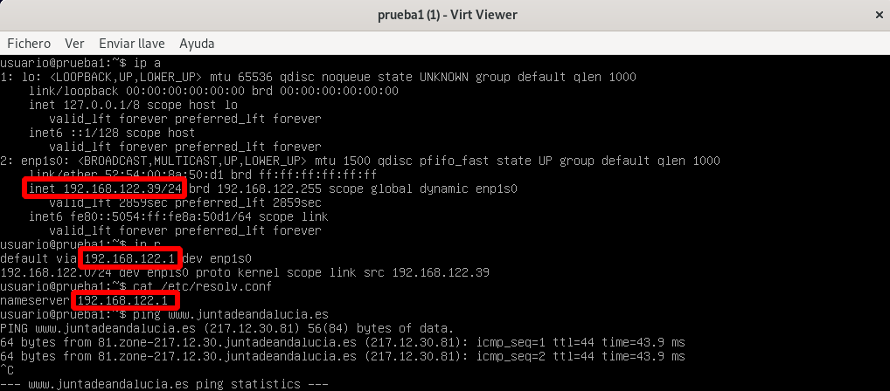
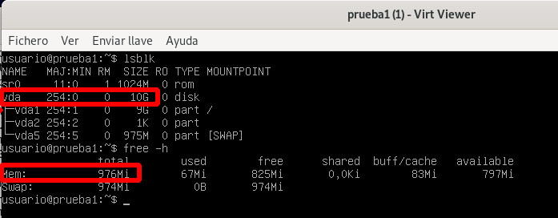
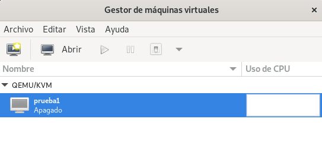

<!-- _class: portada -->
<!-- _paginate: false -->
<!-- _header: '' -->

# **QEMU/KVM** y libvirt

## Instalación, gestión y almacenamiento

<div style="margin-top:2rem; display:flex; flex-direction:column; gap:0.5rem; justify-content:center; font-size:0.85rem; color:white">
  <span>📧 José Domingo Muñoz</span>
  <span>🏫 IES Gonzalo Nazareno · Dos Hermanas</span>
  <span>📚 IV · Infraestructura Virtual</span>
</div>

---

<!-- _class: capitulo -->
<!-- _paginate: false -->

<p class="numero">01</p>

# Introducción a QEMU/KVM + libvirt

## Instalación, red y almacenamiento por defecto

---

## Instalación de QEMU/KVM + libvirt

```bash
root@kvm:~# apt install qemu-system libvirt-clients libvirt-daemon-system

root@kvm:~# adduser usuario libvirt

usuario@kvm:~$ virsh -c qemu:///system list
```

Para no tener que indicar la conexión en cada comando, podemos definir una variable de entorno:

```bash
export LIBVIRT_DEFAULT_URI='qemu:///system'
```

<div class="alerta alerta-info" style="margin-top:0.6rem">
<span>ℹ️</span><div>Con la variable definida, todos los comandos <code>virsh</code> usarán <code>qemu:///system</code> sin especificarlo.</div>
</div>

---

## Red disponible por defecto

```bash
usuario@kvm:~$ virsh net-list --all
 Nombre    Estado     Inicio automático   Persistente
-------------------------------------------------------
 default   inactivo   no                  si

usuario@kvm:~$ virsh net-start default
La red default se ha iniciado

usuario@kvm:~$ virsh net-autostart default
La red default ha sido marcada para iniciarse automáticamente
```

---

## Características de la red `default`

La red `default` es de tipo **NAT**. Al crear una MV se conectará a ella por defecto:

1. El host tiene un **servidor DHCP** (rango: `192.168.122.2 – 192.168.122.254`)
2. La **puerta de enlace** de la MV es `192.168.122.1` (el propio host)
3. El **servidor DNS** de la MV también es el host
4. La MV se conecta a un **Linux Bridge** llamado `virbr0`
5. El host se conecta al bridge `virbr0` con la IP `192.168.122.1`
6. El host realiza **SNAT** para dar conectividad al exterior

---

## Red `default` — esquema



---

## Almacenamiento disponible por defecto

- Los discos de las MV se guardan por defecto en **ficheros con formato `qcow2`**
- El directorio de almacenamiento es **`/var/lib/libvirt/images`**



---

## Pools y volúmenes

<div class="cols-2" style="margin-top:0.8rem">

<div class="card card-blue">

### Pool de almacenamiento

Recurso de almacenamiento gestionado por libvirt. Normalmente es un **directorio**.

```bash
virsh pool-list
 Nombre    Estado   Inicio automático
---------------------------------------
 default   activo   si
 iso       activo   si
```

</div>

<div class="card card-green">

### Volumen

Medio de almacenamiento creado en un pool. Si el pool es de tipo `dir`, el volumen es un **fichero de imagen**.

```bash
virsh vol-list default
 Nombre          Ruta
-----------------------------------------------------
 prueba1.qcow2   /var/lib/libvirt/images/prueba1.qcow2
```

</div>

</div>

---

## virt-install

```bash
apt install virtinst
```

Ejemplo — crear una MV con instalación desde ISO:

```bash
virt-install \
             --virt-type kvm \
             --name prueba1 \
             --cdrom ~/iso/debian-11.3.0-amd64-netinst.iso \
             --os-variant debian10 \
             --disk size=10 \
             --memory 1024 \
             --vcpus 1
```

Para acceder a la consola gráfica:

```bash
virt-viewer prueba1
```

---

## Gestión de MV con virsh

```bash
virsh --help
virsh list --help
```

Subcomandos más usados:

```
list --all                       dominfo <máquina>
shutdown <máquina>               domifaddr <máquina>
start <máquina>                  domblklist <máquina>
autostart <máquina>
reboot <máquina>
destroy <máquina>
suspend <máquina>
resume <máquina>
undefine --remove-all-storage <máquina>
```

---

## Definición XML de una máquina

```bash
virsh dumpxml <máquina>
```

```xml
<domain type='kvm' id='6'>
  <name>prueba1</name>
  <uuid>a88eebdc-8a00-4b9d-bf48-cbed7bb448d3</uuid>
  ...
  <memory unit='KiB'>1048576</memory>
  <currentMemory unit='KiB'>1048576</currentMemory>
  <vcpu placement='static'>1</vcpu>
  ...
  <os>
    <type arch='x86_64' machine='pc-q35-5.2'>hvm</type>
    <boot dev='hd'/>
  </os>
```

---

## Definición XML — disco e interfaz de red

```xml
  <disk type='file' device='disk'>
    <driver name='qemu' type='qcow2'/>
    <source file='/var/lib/libvirt/images/prueba1.qcow2'/>
    <target dev='vda' bus='virtio'/>
    <address type='pci' domain='0x0000' bus='0x04' slot='0x00' function='0x0'/>
  </disk>
  ...
  <interface type='network'>
    <mac address='52:54:00:8a:50:d1'/>
    <source network='default'/>
    <model type='virtio'/>
    <address type='pci' domain='0x0000' bus='0x01' slot='0x00' function='0x0'/>
  </interface>
```

<div class="alerta alerta-info" style="margin-top:0.5rem">
<span>ℹ️</span><div>El disco y la tarjeta de red usan el bus <strong>virtio</strong> para mayor rendimiento (dispositivos paravirtualizados).</div>
</div>

---

## Modificación de una máquina virtual

<div class="cols-2" style="margin-top:0.6rem">

<div class="card card-blue">

### Edición XML directa

```bash
virsh edit prueba1
```

Abre el XML en `$EDITOR`. Útil para cambios no soportados por comandos.

</div>

<div class="card card-green">

### Comandos virsh

```bash
# Renombrar (MV parada)
virsh domrename prueba2 prueba1

# Cambiar vCPUs (MV parada)
virsh setvcpus prueba1 2 --config
```

</div>

</div>

<div class="alerta alerta-warning" style="margin-top:0.5rem">
<span>⚠️</span><div>Algunos cambios requieren la MV <strong>parada</strong>, otros admiten <strong>cambio en caliente</strong> y otros necesitan <strong>reinicio</strong>.</div>
</div>

---

## Modificación de memoria

Con la MV **parada**, editando el XML:

```bash
virsh edit prueba1
...
  <memory unit='KiB'>3145728</memory>
  <currentMemory unit='KiB'>1048576</currentMemory>
...
```

O **en caliente** con la MV arrancada:

```bash
virsh start prueba1

virsh setmem prueba1 2048M
```

---

## virt-manager

Aplicación gráfica para gestionar libvirt:



---

## Creación de MV Windows

- Configurar disco y tarjeta de red en modo **VirtIO**
- Windows **no tiene soporte nativo** para dispositivos VirtIO
- Añadimos un CDROM adicional con la **ISO de drivers VirtIO**

```bash
virt-install \
             --virt-type kvm \
             --name prueba4 \
             --cdrom ~/iso/Win10_21H2_Spanish_x64.iso \
             --os-variant win10 \
             --disk size=40,bus=virtio \
             --disk ~/iso/virtio-win-0.1.217.iso,device=cdrom \
             --network=default,model=virtio \
             --memory 2048 \
             --vcpus 2
```

---

<!-- _class: capitulo -->
<!-- _paginate: false -->

<p class="numero">02</p>

# Almacenamiento en QEMU/KVM + libvirt

## Pools, volúmenes y gestión con virsh y qemu-img

---

## Conceptos de almacenamiento

<div class="cols-2" style="margin-top:0.8rem">

<div class="card card-blue">

### Pool de almacenamiento

Recurso de almacenamiento gestionado por libvirt.

**Tipos principales:**
- `dir` — directorio del sistema de archivos
- `logical` — grupo de volúmenes LVM
- `netfs` — directorio NAS (NFS…)
- `iSCSI` — disco desde servidor iSCSI

</div>

<div class="card card-green">

### Volumen

Medio de almacenamiento que representa el **disco de una MV**.

Según el tipo de pool, puede ser:
- Un **fichero de imagen** (`dir`, `netfs`)
- Un **volumen lógico LVM** (`logical`)
- Un **disco iSCSI** (`iscsi`)

</div>

</div>

---

## Tipos de pool: `dir`

- El pool controla un **directorio del host**
- Los volúmenes son **ficheros de imagen de disco**:

| Formato | Características |
|:--|:--|
| **raw** | Imagen binaria. Ocupa todo el espacio asignado. Más eficiente. Sin snapshots |
| **qcow2** | Copy-on-write. Aprovisionamiento ligero. Soporta snapshots. Algo menos eficiente |
| vdi, vmdk | Formatos de otros hipervisores (VirtualBox, VMware) |

<div class="alerta alerta-warning" style="margin-top:0.5rem">
<span>⚠️</span><div>El tipo <code>dir</code> <strong>no ofrece almacenamiento compartido</strong> entre hosts.</div>
</div>

---

## Tipos de pool: `logical`, `netfs`, `iSCSI`

<div class="cols-3" style="margin-top:0.8rem">

<div class="card card-blue">

### `logical`

- Controla un **Grupo de Volúmenes LVM**
- Los volúmenes son **LVs**
- Sin almacenamiento compartido
- Sin snapshots ni aprovisionamiento ligero

</div>

<div class="card card-green">

### `netfs`

- Monta un **directorio NAS** (NFS…)
- Volúmenes: **ficheros de imagen**
- **Almacenamiento compartido** entre hosts

</div>

<div class="card card-purple">

### `iSCSI`

- Monta un **disco desde un servidor iSCSI**
- Los datos se guardan en ese disco remoto
- **Almacenamiento compartido** (con las consideraciones de acceso concurrente)

</div>

</div>

---

## Gestión de volúmenes — dos enfoques

<div class="cols-2" style="margin-top:0.8rem">

<div class="card card-blue">

### Con libvirt (`virsh` / `virt-manager`)

- Pool `dir` → crea una **imagen de disco**
- Pool `logical` → crea un **LV**

</div>

<div class="card card-green">

### Con herramientas específicas

- Pool `dir` → `qemu-img create …` y luego `pool-refresh`
- Pool `logical` → `lvcreate …` y luego `pool-refresh`

</div>

</div>

<div class="alerta alerta-info" style="margin-top:0.8rem">
<span>ℹ️</span><div>Tras crear el volumen con herramientas externas hay que ejecutar <code>virsh pool-refresh &lt;pool&gt;</code> para que libvirt lo detecte.</div>
</div>

---

## Gestión de pools de almacenamiento

```bash
virsh pool-list
virsh pool-info default
virsh pool-dumpxml default

# Crear, construir, arrancar y persistir un nuevo pool
virsh pool-define-as vm-images dir --target /srv/images
virsh pool-build vm-images
virsh pool-start vm-images
virsh pool-autostart vm-images

# Detener y eliminar
virsh pool-destroy vm-images
virsh pool-delete vm-images
virsh pool-undefine vm-images
```

---

## Gestión de volúmenes con libvirt

```bash
virsh vol-list default
virsh vol-list default --details
virsh vol-info prueba1.qcow2 default
virsh vol-dumpxml vol.qcow2 default

# Crear un volumen qcow2 de 10 GB en el pool default
virsh vol-create-as default vol1.qcow2 --format qcow2 10G

# Eliminar un volumen
virsh vol-delete vol1.qcow2 default
```

---

## Gestión de volúmenes con `qemu-img`

Trabajamos con un pool de tipo **`dir`**:

```bash
cd /var/lib/libvirt/images

# Crear imagen qcow2 de 2 GB
qemu-img create -f qcow2 vol2.qcow2 2G

# Ver información de la imagen
qemu-img info vol2.qcow2

# Hacer que libvirt detecte el nuevo fichero
virsh pool-refresh vm-images
```

---

## Creación de MV usando volúmenes existentes

```bash
virt-install \
             --virt-type kvm \
             --name prueba4 \
             --cdrom ~/iso/debian-11.3.0-amd64-netinst.iso \
             --os-variant debian10 \
             --disk vol=default/vol1.qcow2 \
             --memory 1024 \
             --vcpus 1
```

Otras formas de indicar el disco:

```bash
--disk path=/var/lib/libvirt/images/vol1.qcow2
--disk pool=vm-images,size=10
```

---

## Añadir nuevos discos a una MV

```bash
# Añadir disco (también funciona en caliente)
virsh attach-disk prueba4 \
        /srv/images/vol2.qcow2 vdb \
        --driver=qemu --type disk \
        --subdriver qcow2 \
        --persistent

# Eliminar disco
virsh detach-disk prueba4 vdb --persistent
```

<div class="alerta alerta-info" style="margin-top:0.6rem">
<span>ℹ️</span><div><code>--persistent</code> guarda el cambio en la configuración XML de la MV para que persista tras reinicios.</div>
</div>

---

## Redimensión de discos

Con la MV **parada**:

```bash
# Con libvirt
virsh vol-resize vol2.qcow2 3G --pool vm-images

# Con qemu-img
sudo qemu-img resize /srv/images/vol2.qcow2 3G
```

Con la MV **en ejecución** (en caliente):

```bash
virsh domblklist prueba4
virsh blockresize prueba4 /srv/images/vol2.qcow2 3G
```

Dentro de la MV, redimensionar el sistema de ficheros:

```bash
resize2fs /dev/vdb
```

---

## Redimensión del sistema de ficheros de una imagen

Para redimensionar el SF **sin entrar en la MV** usamos **`virt-resize`**:

```bash
# 1. Ampliar el fichero de imagen
qemu-img resize vol1.qcow2 10G

# 2. Copiar la imagen (virt-resize trabaja origen → destino)
cp vol1.qcow2 newvol1.qcow2

# 3. Expandir la partición dentro de la imagen
virt-resize --expand /dev/sda1 vol1.qcow2 newvol1.qcow2

# 4. Reemplazar la imagen original
mv newvol1.qcow2 vol1.qcow2
```

<div class="alerta alerta-warning" style="margin-top:0.5rem">
<span>⚠️</span><div><code>virt-resize</code> requiere el paquete <code>libguestfs-tools</code>. Siempre trabaja sobre una copia del fichero original.</div>
</div>

---

<!-- _class: cierre -->
<!-- _paginate: false -->

# ¡Gracias!

## QEMU/KVM y libvirt

<div style="margin-top:2rem; display:flex; gap:2rem; justify-content:center; font-size:0.85rem; color:#64748b">
  <span>📧 José Domingo Muñoz</span>
  <span>🏫 IES Gonzalo Nazareno · Dos Hermanas</span>
  <span>📚 IV</span>
</div>
