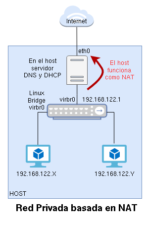
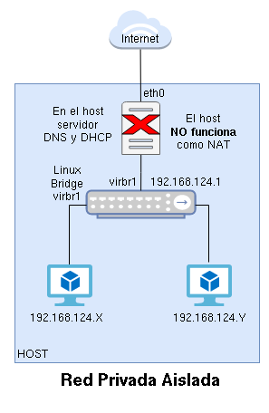
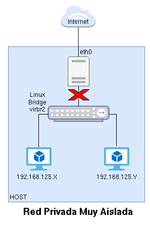
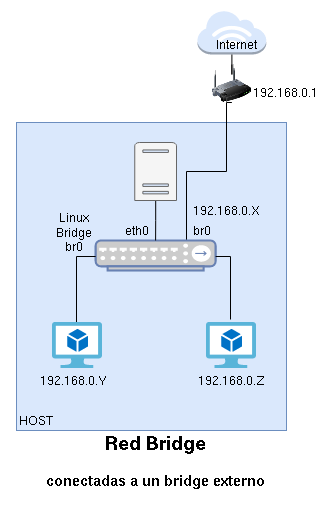
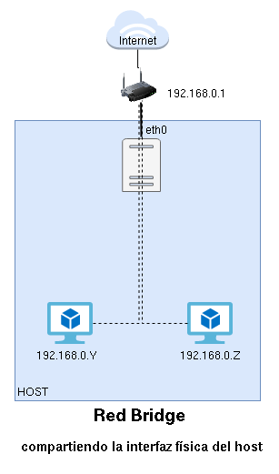

<!-- _class: portada -->
<!-- _paginate: false -->
<!-- _header: '' -->

# Redes en **QEMU/KVM** + libvirt

## Redes virtuales, bridges y gestión con virsh

<div style="margin-top:2rem; display:flex; flex-direction:column; gap:0.5rem; justify-content:center; font-size:0.85rem; color:white">
  <span>📧 José Domingo Muñoz</span>
  <span>🏫 IES Gonzalo Nazareno · Dos Hermanas</span>
  <span>📚 IV · Infraestructura Virtual</span>
</div>

---

<!-- _class: capitulo -->
<!-- _paginate: false -->

<p class="numero">01</p>

# Tipos de red en libvirt

## Redes virtuales y redes puente

---

## Introducción — dos grandes grupos

<div class="cols-2" style="margin-top:0.8rem">

<div class="card card-blue">

### Redes Virtuales (Privadas)

Redes privadas gestionadas por libvirt:

- **NAT** — las MV salen al exterior a través del host
- **Aisladas** — comunicación entre MV y host, sin exterior
- **Muy aisladas** — solo comunicación entre MV, sin host ni exterior

</div>

<div class="card card-green">

### Redes Puente (Públicas)

Las MV se conectan a la misma red que el host:

- **Bridge externo** — interfaz física del host unida a un bridge virtual
- **Compartiendo la interfaz física** — la MV comparte directamente la NIC del host

</div>

</div>

<div class="alerta alerta-info" style="margin-top:0.6rem">
<span>ℹ️</span><div>libvirt usa <strong>Linux Bridge</strong> como switch virtual para gestionar la conectividad entre MV y el exterior.</div>
</div>

---

## Red virtual de tipo NAT



---

## Red virtual aislada (*Isolated*)



---

## Red virtual muy aislada (*Very Isolated*)



---

## Red puente conectada a un bridge externo



---

## Red puente compartiendo la interfaz del host



---

<!-- _class: capitulo -->
<!-- _paginate: false -->

<p class="numero">02</p>

# Definición y gestión de redes virtuales

## XML, virsh y configuración de cada tipo

---

## Definición XML — red NAT

Plantilla en `/usr/share/libvirt/networks/default.xml`:

```xml
<network>
  <name>default</name>
  <bridge name='virbr0'/>
  <forward/>
  <ip address='192.168.122.1' netmask='255.255.255.0'>
    <dhcp>
      <range start='192.168.122.2' end='192.168.122.254'/>
    </dhcp>
  </ip>
</network>
```

<div class="alerta alerta-info" style="margin-top:0.6rem">
<span>ℹ️</span><div>Para crear una nueva red NAT, copia este fichero, cambia el <strong>nombre</strong>, la <strong>interfaz bridge</strong> y el <strong>direccionamiento IP</strong>.</div>
</div>

---

## Definición XML — red aislada e red muy aislada

Red **aislada** (con DHCP, sin salida al exterior):

```xml
<network>
  <name>red_aislada</name>
  <bridge name='virbr1'/>
  <ip address='192.168.123.1' netmask='255.255.255.0'>
    <dhcp>
      <range start='192.168.123.2' end='192.168.123.254'/>
    </dhcp>
  </ip>
</network>
```

Red **muy aislada** (sin host, sin DHCP, sin exterior):

```xml
<network>
  <name>red_muy_aislada</name>
  <bridge name='virbr2'/>
</network>
```

<div class="alerta alerta-info" style="margin-top:0.4rem">
<span>ℹ️</span><div>En redes aisladas, eliminar la etiqueta <code>&lt;dhcp&gt;</code> desactiva el servidor DHCP.</div>
</div>

---

## Gestión de redes virtuales con virsh

```bash
virsh net-list --all
virsh net-define   red-nat.xml
virsh net-start    red_nat
virsh net-autostart red_nat
virsh net-info     red_nat
virsh net-dumpxml  red_nat
```

También se pueden gestionar desde **`virt-manager`**.

---

<!-- _class: capitulo -->
<!-- _paginate: false -->

<p class="numero">03</p>

# Redes puente (públicas)

## Linux Bridge externo e interfaz compartida

---

## ¿Qué es un bridge externo?

- Un **bridge virtual** conectado al router de la red local
- Se crea en el **host** y él mismo se conecta a ese bridge
- Las MV conectadas al bridge obtienen IPs del **mismo rango que el host**


---

## Configuración del bridge externo (`br0`)

- El bridge se llamará **`br0`**; aparece en el host como una interfaz de red
- **`br0`** se configura con IP estática o dinámica (según la red local)
- La **interfaz física** (`eth0`) se une a `br0` y pierde su IP
- Las MV conectadas a `br0` tomarán IPs del mismo rango que el host

<div class="alerta alerta-warning" style="margin-top:0.8rem">
<span>⚠️</span><div>Las tarjetas <strong>WiFi</strong> suelen tener problemas para conectarse a bridges virtuales. Usa siempre interfaz <strong>cableada</strong> para el bridge externo.</div>
</div>

<div class="alerta alerta-info" style="margin-top:0.4rem">
<span>ℹ️</span><div>Asegúrate de tener instalado el paquete <code>bridge-utils</code>.</div>
</div>

---

## Creación del bridge según el gestor de red

| Entorno | Herramienta | Fichero de configuración |
|:--|:--|:--|
| Debian con escritorio Gnome | **NetworkManager** | Interfaz gráfica |
| Debian sin entorno gráfico | **networking** | `/etc/network/interfaces` |
| Ubuntu | **netplan** | `/etc/netplan/*.yaml` |

---

## Definición XML — red puente

Con **virsh** (opcional, no obligatorio):

```xml
<network>
  <name>red_bridge</name>
  <forward mode="bridge"/>
  <bridge name="br0"/>
</network>
```

```bash
virsh net-define red-bridge.xml
virsh net-start  red_bridge
```

<div class="alerta alerta-info" style="margin-top:0.6rem">
<span>ℹ️</span><div>No es obligatorio definir esta red en libvirt. Al crear la MV se puede conectar directamente al bridge <code>br0</code> sin necesidad de una definición XML.</div>
</div>

---

## Red puente compartiendo la interfaz física

```xml
<network>
  <name>red_interface</name>
  <forward mode="bridge">
    <interface dev="enp1s0"/>
  </forward>
</network>
```

---

<!-- _class: capitulo -->
<!-- _paginate: false -->

<p class="numero">04</p>

# Conectar MV a redes

## virt-install y gestión de interfaces con virsh

---

## Crear MV conectada a una red existente

```bash
virt-install \
             --virt-type kvm \
             --name prueba5 \
             --cdrom ~/iso/debian-11.3.0-amd64-netinst.iso \
             --os-variant debian10 \
             --network network=red_nat \
             --disk size=10 \
             --memory 1024 \
             --vcpus 1
```

- `--network network=red_nat` — conectar a una red virtual definida en libvirt
- `--network bridge=virbr1` — conectar directamente a un bridge
- Se pueden indicar **varios parámetros `--network`** para múltiples interfaces

---

## Añadir interfaces de red a una MV

```bash
# Conectar a una red virtual
virsh attach-interface prueba4 \
      network red_nat \
      --model virtio \
      --persistent

# Conectar directamente a un bridge
virsh attach-interface prueba4 \
      bridge virbr1 \
      --model virtio \
      --persistent
```

<div class="alerta alerta-info" style="margin-top:0.6rem">
<span>ℹ️</span><div>Tras añadir la interfaz hay que <strong>configurarla dentro de la MV</strong> (IP, máscara, puerta de enlace).</div>
</div>

---

## Eliminar interfaces de red de una MV

```bash
virsh detach-interface prueba4 bridge \
      --mac 52:54:00:0c:06:2a \
      --persistent
```

La MAC se obtiene con:

```bash
virsh domiflist prueba4
```

---

## Consideraciones de configuración de red

| Tipo de red | Configuración en la MV |
|:--|:--|
| **NAT** | DHCP automático (servidor en el host) |
| **Aislada** | **Estática**, mismo rango que la IP del host en esa red |
| **Muy aislada** | **Estática**, cualquier direccionamiento |
| **Bridge externo** | DHCP o estática, mismo rango que el host en la red local |

<div class="alerta alerta-warning" style="margin-top:0.8rem">
<span>⚠️</span><div>En redes <strong>aisladas</strong> y <strong>muy aisladas</strong> no hay servidor DHCP (salvo que lo configures explícitamente), por lo que la interfaz debe configurarse de forma <strong>estática</strong>.</div>
</div>

---

<!-- _class: cierre -->
<!-- _paginate: false -->

# ¡Gracias!

## Redes en QEMU/KVM + libvirt

<div style="margin-top:2rem; display:flex; gap:2rem; justify-content:center; font-size:0.85rem; color:#64748b">
  <span>📧 José Domingo Muñoz</span>
  <span>🏫 IES Gonzalo Nazareno · Dos Hermanas</span>
  <span>📚 IV</span>
</div>
