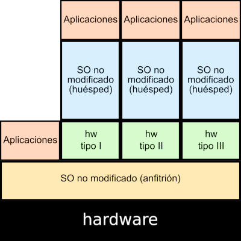
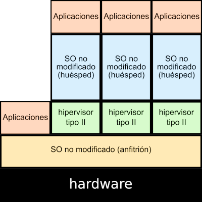

<!-- _class: portada -->
<!-- _paginate: false -->
<!-- _header: '' -->

# **Virtualización** en Linux

## Conceptos, tipos y herramientas

  📧 José Domingo Muñoz
  🏫 IES Gonzalo Nazareno · Dos Hermanas
  📚 IV · Infraestructura Virtual

---

<!-- _class: capitulo -->
<!-- _paginate: false -->

01

# Introducción a la virtualización

## Concepto, usos, ventajas y desventajas

---

## ¿Qué es la virtualización?

> La **virtualización** utiliza el software para imitar las características del hardware y crear un sistema informático virtual.

### Idea fundamental

- Permite ejecutar **varios sistemas virtuales** sobre un mismo equipo físico
- Múltiples **sistemas operativos** y aplicaciones funcionando en paralelo
- Aumenta el **rendimiento** del hardware disponible
- Aprovecha el tiempo de procesamiento que normalmente se desperdicia

ℹ️
La virtualización es la base sobre la que se construyen las modernas plataformas <strong>cloud</strong> y los sistemas de despliegue automatizado.

---

## ¿Para qué se utiliza?

- **Servidores**: aislar servicios, migrar en vivo, montar clústeres
- **Desarrollo y formación**: laboratorios de pruebas sin riesgo
- **Aprovechamiento del hardware**: varios sistemas en el mismo equipo

### Ventajas

- **Ahorro** económico y energético
- **Aislamiento** entre servicios

### Desventajas

- Depende de un **único equipo físico**
- Mayor **complejidad** de gestión

---

<!-- _class: capitulo -->
<!-- _paginate: false -->

02

# Tipos de virtualización

## Emulación, virtualización completa (tipo 1 y 2) y contenedores

---

## ¿Por qué hacen falta extensiones de virtualización?

Una **extensión de virtualización** es una ampliación del juego de instrucciones del procesador para ejecutar hipervisores de forma eficiente — es lo que se llama **virtualización asistida por hardware**.

> El **hipervisor** es el software que gestiona las máquinas virtuales y reparte entre ellas los recursos del equipo físico.

### Sin extensiones

- El hipervisor **vigila y traduce por software** cada instrucción sensible del invitado
- Complejo y con **peor rendimiento**

### Con extensiones (VT-x / AMD-V)

- El procesador distingue entre **hipervisor** e **invitado**
- El invitado ejecuta casi todo **directamente sobre el hardware real**

---

## Emulación

- El hipervisor **imita por software** una arquitectura completa: procesador, memoria, instrucciones, comunicaciones…
- Los programas se ejecutan creyendo que están sobre una **arquitectura concreta**
- Útil para correr software de **otra plataforma** (ej: ARM sobre x86)
- **Rendimiento bastante bajo**

### Ejemplos

`QEMU` · `Microsoft Virtual PC` · `Wine`

---

## Virtualización completa

- El hipervisor simula **suficiente hardware** para que un sistema operativo **no adaptado** —el **invitado** (*guest*)— se ejecute aislado sobre el **anfitrión** (*host*, el equipo físico), sin darse cuenta de que está virtualizado
- La CPU **debe disponer** de las extensiones de virtualización (Intel VT / AMD-V)
- Se clasifica en **dos tipos**, según dónde se ejecuta el hipervisor

---

## Tipo 1 (nativo) y Tipo 2 (alojado)

### Tipo 1 — nativo / *bare-metal*

- **Acceso directo al hardware** — no hay un SO de propósito general por debajo (así **KVM convierte Linux en hipervisor**)
- **Mayor rendimiento**: opción habitual en servidores

#### Ejemplos

`KVM` · `Xen` · `VMware ESXi` · `Microsoft Hyper-V`

### Tipo 2 — alojado / *hosted*

- El hipervisor se instala **como una aplicación más** sobre el SO del host
- **Menor rendimiento**: añade una capa extra entre el hardware y la VM

#### Ejemplos

`VirtualBox` · `VMware Workstation` · `Parallels Desktop`

---

## Virtualización ligera o en contenedores

- También llamada **virtualización a nivel de SO**
- Sobre el **núcleo** del SO se ejecuta una capa que permite múltiples **espacios de usuario aislados** (contenedores)
- Un contenedor es un **conjunto de procesos** aislados con:
  - **Sistema de ficheros** propio
  - **Configuración de red** propia
  - Acceso a recursos del host (CPU, memoria)

---

## Tipos de contenedores

### Contenedores de **sistema**

Su uso es similar al de una máquina virtual tradicional:

- Se accede por **SSH**
- Se **instalan servicios**, se actualizan
- Ejecutan un **conjunto de procesos**

#### Ejemplo

`LXC` *(Linux Container)*

### Contenedores de **aplicación**

Pensados para el **despliegue** de aplicaciones (especialmente web):

- Una aplicación = un contenedor
- Imágenes versionadas y portables
- Base del *cloud-native*

#### Ejemplos

`Docker` · `Podman`

---

## Resumen comparativo

| Tipo | Hipervisor | SO modificado | Rendimiento | Ejemplos |
|:--|:--|:--:|:--|:--|
| **Emulación** | — | No | Muy bajo | QEMU, Wine |
| **Virtualización completa** | Tipo 1 (nativo) | No | Alto | KVM, Xen, ESXi |
| **Virtualización completa** | Tipo 2 (alojado) | No | Medio | VirtualBox, VMware |
| **Contenedores** | — | — | Casi nativo | LXC, Docker |

---

<!-- _class: capitulo -->
<!-- _paginate: false -->

03

# QEMU/KVM y libvirt

## Virtualización completa en Linux

---

## QEMU

> **QEMU** es un emulador genérico y de código abierto de máquinas virtuales.

### Dos modos de funcionamiento

### Modo **emulador**

- Permite ejecutar SO de una **arquitectura distinta** (ej. ARM sobre x86)
- Útil para **desarrollo cruzado**
- Rendimiento bajo

### Modo **virtualización**

- Apoyado en hipervisores como **KVM**
- Aprovecha las extensiones del procesador
- **Alto rendimiento**

---

## KVM

> **Kernel-based Virtual Machine** es un hipervisor de **tipo 1** integrado al kernel de Linux.

### Características

- Solución de **virtualización completa** para Linux
- Necesita CPU con extensiones **Intel VT** o **AMD-V**
- Se compone de varios **módulos del kernel**:
  - `kvm.ko` — infraestructura base de virtualización
  - `kvm-intel.ko` / `kvm-amd.ko` — módulo específico del procesador

ℹ️
<strong>QEMU + KVM</strong> es la combinación habitual: QEMU emula los dispositivos y KVM acelera la ejecución del invitado.

---

## Dispositivos paravirtualizados (`virtIO`)

- En virtualización completa, los dispositivos (discos, red…) están **emulados por software**: el invitado cree que habla con hardware real, y cada operación se traduce mediante una capa de emulación
- Un dispositivo **paravirtualizado** es distinto: el invitado *sabe* que está virtualizado y usa un **driver específico** que habla directamente con el hipervisor mediante una interfaz simple y eficiente, sin fingir ser hardware real
- KVM agrupa estos dispositivos bajo el estándar **`virtIO`**

### Dispositivos emulados

- Compatibilidad universal
- **Rendimiento bajo**
- Cada operación atraviesa la capa de emulación

### Dispositivos `virtIO`

- **`virtio-net`** — tarjeta de red
- **`virtio-blk` / `virtio-scsi`** — disco
- **Rendimiento muy cercano al real**

---

## libvirt

> **libvirt** es la API y conjunto de herramientas que facilita la **gestión** de los recursos virtualizados.

### ¿Por qué libvirt?

- Trabajar directamente con QEMU/KVM es **complejo**
- libvirt ofrece una **API genérica** y un **demonio** comunes
- Soporta varios sistemas: **KVM**, **LXC**, **Xen**…
- Permite usar las **mismas herramientas** independientemente del hipervisor

---

## Mecanismos de conexión a libvirt

### Local sin privilegios

`qemu:///session`

- Acceso a las VM **del usuario actual**
- Sin permisos para crear redes
- Útil para usuarios de escritorio

### Local privilegiado

`qemu:///system`

- Acceso a las VM **del sistema**
- Permisos completos sobre red y almacenamiento

### Remoto privilegiado por SSH

`qemu+ssh:///system`

- Conexión **a un servidor remoto** que ejecuta libvirt
- Autenticación a través de **SSH**
- Base para administrar **clústeres** de hipervisores

---

## Aplicaciones del ecosistema libvirt

| Aplicación | Función |
|:--|:--|
| **virsh** | Cliente oficial de **línea de comandos**. Shell completa para la API |
| **virt-manager** | Aplicación **gráfica** con la mayor parte de las funcionalidades |
| **virt-install** | Creación de MV desde la **línea de comandos** (`virt-install`, `virt-clone`, `virt-xml`) |
| **virt-viewer** | Acceso a la **consola gráfica** de una VM |
| **gnome-boxes** | Aplicación gráfica **simple** para usuarios de escritorio |

ℹ️
<code>virsh</code> es la herramienta de referencia para automatizar y administrar libvirt en servidores sin entorno gráfico.

---

<!-- _class: cierre -->
<!-- _paginate: false -->

# ¡Gracias!

## Virtualización en Linux

  📧 José Domingo Muñoz
  🏫 IES Gonzalo Nazareno · Dos Hermanas
  📚 IV

