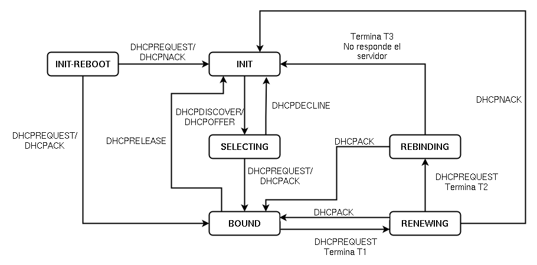

<!-- _class: portada -->
<!-- _paginate: false -->
<!-- _header: '' -->

# Protocolo **DHCP**

## Servidor Kea DHCP

<div style="margin-top:2rem; display:flex; flex-direction:column; gap:0.5rem; justify-content:center; font-size:0.85rem; color:white">
  <span>📧 José Domingo Muñoz</span>
  <span>🏫 IES Gonzalo Nazareno · Dos Hermanas</span>
  <span>📚 SRI · Servicios de Red e Internet</span>
</div>

---

<!-- _class: capitulo -->
<!-- _paginate: false -->

<p class="numero">01</p>

# El protocolo DHCP

## Concepto, mensajes y estados

---

## ¿Qué es DHCP?

> **Dynamic Host Configuration Protocol** es un estándar TCP/IP que automatiza la asignación de la configuración de red a los equipos de una red local.

### Idea fundamental

- Un **servidor DHCP** gestiona un conjunto de direcciones IP de una subred
- Cuando un cliente arranca, **solicita** su configuración al servidor
- El servidor mantiene una tabla de **correspondencia IP ↔ MAC** y de las concesiones activas
- Evita la configuración manual y los conflictos de direcciones

<div class="alerta alerta-info" style="margin-top:0.8rem">
<span>ℹ️</span><div>El servidor escucha en el puerto <strong>67/udp</strong> y el cliente en el <strong>68/udp</strong>.</div>
</div>

---

## Mensajes del protocolo (DORA)

<div class="cols-2" style="margin-top:0.8rem">

<div class="card card-blue">

### 1 · DHCP **Discover**

El cliente envía un **broadcast** a `255.255.255.255` solicitando configuración.

### 2 · DHCP **Offer**

El servidor responde al cliente (identificado por su MAC) ofreciéndole los parámetros.

</div>

<div class="card card-green">

### 3 · DHCP **Request**

El cliente confirma al servidor (ya identificado por IP) que **acepta** los parámetros.

### 4 · DHCP **Acknowledgement**

El servidor confirma la concesión y comunica el **lease time**.

</div>

</div>

<div class="alerta alerta-info" style="margin-top:0.8rem">
<span>ℹ️</span><div>Los pasos 3 y 4 evitan conflictos cuando hay <strong>varios servidores</strong> DHCP en la misma red.</div>
</div>

---

## Estados del protocolo



---

## Estado SELECTING

El cliente parte de **INIT** y busca un servidor DHCP en la red.

### Pasos

- Espera un tiempo aleatorio (1–10 s) para evitar colisiones
- Envía un **DHCPDISCOVER** por broadcast
- Recibe un **DHCPOFFER** del servidor
- Confirma con **DHCPREQUEST** y recibe **DHCPACK**
- Comprueba con **ARP** que la IP no está en uso

<div class="alerta alerta-warning" style="margin-top:0.8rem">
<span>⚠️</span><div>Si la IP ya está en uso, el cliente envía un <strong>DHCPDECLINE</strong> y vuelve al estado <code>INIT</code>.</div>
</div>

---

## Estado BOUND y temporizadores

El cliente ya tiene su configuración aplicada. Se establecen **tres tiempos** que regulan la concesión:

<div class="cols-2" style="margin-top:0.8rem">

<div>

| Temporizador | Significado |
|:--|:--|
| **T1** | Tiempo de **renovación** del alquiler |
| **T2** | Tiempo de **reenganche** |
| **T3** | **Duración** total del alquiler |

</div>

<div>

### Valores por defecto

Si el servidor sólo envía T3, el cliente calcula:

- **T1 = 0,5 × T3**
- **T2 = 0,875 × T3**

</div>

</div>

---

## Estado RENEWING

Al expirar **T1**, el cliente intenta renovar la concesión con el **mismo servidor**.

### Posibles desenlaces

- ✅ El servidor **acepta**: vuelve a `BOUND` y se reinicia T3
- ❌ El servidor responde con **DHCPNACK**: el cliente vuelve a `INIT`
- ⏱ El servidor no responde: el cliente continúa hasta que venza **T2**

<div class="alerta alerta-info" style="margin-top:0.8rem">
<span>ℹ️</span><div>La renovación es <strong>unicast</strong>: el cliente ya conoce la IP de su servidor.</div>
</div>

---

## Estado REBINDING

Al expirar **T2** sin renovación, el cliente intenta extender la concesión con **cualquier** servidor DHCP de la red.

### Pasos

- Envía un **DHCPREQUEST** por broadcast
- Si algún servidor responde con **DHCPACK** → vuelve a `BOUND`, reinicia T1, T2 y T3
- Si ningún servidor responde antes de expirar **T3** → el cliente pasa a `INIT` y pierde la configuración

---

## Otros casos

<div class="cols-2" style="margin-top:0.8rem">

<div class="card card-blue">

### Liberación voluntaria

El cliente puede **renunciar** a la concesión antes de tiempo enviando un **DHCPRELEASE** y volviendo al estado `INIT`.

</div>

<div class="card card-green">

### Reinicio del cliente

Al arrancar, el cliente **guarda** su última configuración y pide al servidor seguir usándola:

- Si la concesión sigue vigente → `BOUND`
- Si ha expirado → `INIT`

</div>

</div>

---

## Conceptos clave del servidor DHCP

- **Ámbito**: agrupamiento administrativo de los equipos de una subred que reciben configuración por DHCP
- **Rango**: conjunto de direcciones IP que el servidor puede conceder
- **Tiempo de concesión** (*lease time*): periodo durante el cual una IP queda asignada al cliente
- **Reserva**: dirección IP **fija** asociada a una **MAC** concreta — el equipo siempre recibe la misma IP

---

## Parámetros que se pueden enviar al cliente

<div class="cols-2" style="margin-top:0.8rem">

<div>

### Configuración básica

- Dirección **IP** y **máscara**
- **Puerta de enlace**
- Dirección de **broadcast**
- **MTU** de la interfaz

</div>

<div>

### Servicios de red

- Servidores **DNS** y nombre de dominio
- Servidores **NTP** (tiempo)
- Servidores **SMTP**
- Servidores **TFTP** (arranque por red)

</div>

</div>

<div class="alerta alerta-info" style="margin-top:0.8rem">
<span>ℹ️</span><div>DHCP centraliza no sólo el direccionamiento, sino prácticamente toda la <strong>configuración de red</strong> del cliente.</div>
</div>

---

<!-- _class: capitulo -->
<!-- _paginate: false -->

<p class="numero">02</p>

# Servidor Kea DHCP

## Configuración moderna del servicio

---

## ¿Qué es Kea?

**Kea** es un servidor DHCP de **ISC** (*Internet Systems Consortium*), sucesor moderno del veterano `isc-dhcp-server`.

### Características

- Diseñado para **escalabilidad** y entornos grandes
- Configuración en **JSON** (en lugar del formato propio de `isc-dhcp-server`)
- Arquitectura **modular**: distintos servicios para IPv4, IPv6, DNS dinámico…
- Soporte para **backends** de almacenamiento de concesiones: archivo (`memfile`), MySQL, PostgreSQL
- Extensible mediante **hooks** (librerías cargables)

---

## Servicios y archivos

<div class="cols-2" style="margin-top:0.8rem">

<div>

### Servicios `systemd`

- `kea-dhcp4-server` — DHCP para IPv4
- `kea-dhcp6-server` — DHCP para IPv6
- `kea-ctrl-agent` — API de control REST
- `kea-dhcp-ddns-server` — actualización dinámica de DNS

</div>

<div>

### Archivos en `/etc/kea/`

- `kea-dhcp4.conf` — configuración del servidor IPv4
- `kea-dhcp6.conf` — configuración del servidor IPv6
- `kea-ctrl-agent.conf` — configuración del agente de control
- `kea-dhcp-ddns.conf` — configuración del DDNS

</div>

</div>

---

## Instalación y gestión

```bash
# Instalación en Debian/Ubuntu
apt install kea-dhcp4-server

# Gestión del servicio
systemctl enable --now kea-dhcp4-server
systemctl restart kea-dhcp4-server
systemctl status kea-dhcp4-server

# Logs
journalctl -u kea-dhcp4-server
```

---

## Estructura del archivo `kea-dhcp4.conf`

El archivo se escribe en **JSON** y todo el contenido va dentro del objeto raíz `Dhcp4`:

```json
{
  "Dhcp4": {
    "interfaces-config": { ... },
    "lease-database":    { ... },
    "valid-lifetime":    86400,
    "subnet4": [ ... ],
    "option-data": [ ... ]
  }
}
```

<div class="alerta alerta-warning" style="margin-top:0.8rem">
<span>⚠️</span><div>JSON no admite comentarios estándar. Kea acepta <code>// comentario</code> como extensión, pero conviene ser cuidadoso con la sintaxis.</div>
</div>

---

## interfaces-config y lease-database

<div class="cols-2" style="margin-top:0.8rem">

<div>

### `interfaces-config`

Define en qué **interfaces** escucha el servidor. Sólo procesa los paquetes recibidos por las interfaces listadas.

```json
"interfaces-config": {
  "interfaces": [ "ens18" ]
}
```

</div>

<div>

### `lease-database`

Almacenamiento de las concesiones activas.

```json
"lease-database": {
  "type": "memfile",
  "persist": true,
  "name": "/var/lib/kea/kea-leases4.csv"
}
```

`memfile` es un archivo CSV; con `persist: true` sobrevive a los reinicios.

</div>

</div>

---

## Tiempos de validez

```json
"valid-lifetime": 86400,
"max-valid-lifetime": 86400
```

- **`valid-lifetime`** — duración por defecto de cada concesión, en segundos (`86400` = 24 h)
- **`max-valid-lifetime`** — tope máximo aceptado si el cliente solicita más tiempo

<div class="alerta alerta-info" style="margin-top:0.8rem">
<span>ℹ️</span><div>De aquí derivan los temporizadores <strong>T1</strong> y <strong>T2</strong> que regulan los estados <code>RENEWING</code> y <code>REBINDING</code>.</div>
</div>

---

## subnet4 y pools

`subnet4` es una **lista** de subredes gestionadas. Cada subred define el rango (`subnet`), uno o varios `pools` y, opcionalmente, sus propias `option-data`.

```json
"subnet4": [
  {
    "subnet": "172.22.0.0/16",
    "pools": [
      { "pool": "172.22.0.5 - 172.22.17.254" }
    ]
  }
]
```

- **`subnet`** — rango total de la red en notación CIDR
- **`pools`** — direcciones IP que el servidor puede **conceder** (subconjunto de la subred)

---

## option-data: parámetros para el cliente

Lista de opciones DHCP que el servidor envía a los clientes:

```json
"option-data": [
  { "name": "routers",             "data": "172.22.0.1" },
  { "name": "domain-name",         "data": "gonzalonazareno.org" },
  { "name": "domain-name-servers", "data": "172.22.0.1,192.168.0.1" },
  { "name": "domain-search",       "data": "gonzalonazareno.org" },
  { "name": "broadcast-address",   "data": "172.22.255.255" }
]
```

Cada entrada tiene un **`name`** estándar (definido por el RFC) y un **`data`** con el valor.

---

## Las concesiones (leases)

Con el backend `memfile`, las concesiones se almacenan en `/var/lib/kea/kea-leases4.csv`.

### Información que contiene

- Dirección **IP** concedida
- Dirección **MAC** del cliente
- **Hostname** declarado
- Marcas de tiempo: inicio y expiración
- **Estado** de la concesión

```bash
# Consulta rápida del archivo
cat /var/lib/kea/kea-leases4.csv
```

<div class="alerta alerta-info" style="margin-top:0.8rem">
<span>ℹ️</span><div>Para entornos grandes existen backends en <strong>MySQL</strong> o <strong>PostgreSQL</strong>, que sustituyen a <code>memfile</code>.</div>
</div>

---

## Para profundizar

- [Servidor DHCP con Kea — fp.josedomingo.org](https://fp.josedomingo.org/sri/2526/u2/kea/)
- [Documentación oficial de Kea (ISC)](https://kea.readthedocs.io/)

---

<!-- _class: cierre -->
<!-- _paginate: false -->

# ¡Gracias!

## DHCP → Resolución de nombres con BIND

<div style="margin-top:2rem; display:flex; gap:2rem; justify-content:center; font-size:0.85rem; color:#64748b">
  <span>📧 José Domingo Muñoz</span>
  <span>🏫 IES Gonzalo Nazareno · Dos Hermanas</span>
  <span>📚 SRI</span>
</div>
